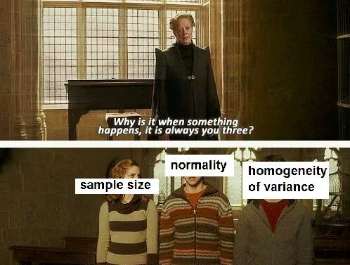

```{r setup, include=FALSE}
knitr::opts_chunk$set(echo = TRUE,
                      fig.width = 6,
                      fig.asp = 0.618,
                      out.width = "70%",
                      fig.align = "center",
                      fig.retina = 3)
```

<link rel="stylesheet" href="https://cdn.rawgit.com/jpswalsh/academicons/master/css/academicons.min.css"/>

## Pressupostos

Antes de avançarmos, é necessário clarificar algo que muitos pesquisadores e cientistas não se atentam e acaba invalidando diversas análises[^1]

### Independência dos Dados

Primeiramente, para quase toda a estatística inferencial[^3], temos o pressuposto de **independência dos dados**. Isso é valido para teste $t$, ANOVA, regressões, entre outros... O pressuposto de independência dos dados quer dizer que o valor de uma observação não influencia ou afeta o valor de outras observações. Caso você encontre dados que violam esse pressuposto, é necessário incluir na sua análise. Fontes comuns de não-independência são[^2]:

[^1]: Não estamos exagerando, quando você aprender o que são os pressupostos de cada técnica estatística vai começar a identificar que muitos artigos por aí não estão nem aí para pressupostos.
[^2]: Análises de séries temporais e análises de dados geoespaciais fazem parte de um projeto futuro nosso.
[^3]: A Estatística pode ser dividida em dois ramos: a descritiva e a inferencial. A Estatistica inferencial é aquela que gera infêrencias a partir dos dados observados sobre o real fenômeno do processo de geração de dados. É a Estatística que vai dos dados observados para as associações prováveis por de trás daquelas observações.

* **Dependência Temporal**: O valor de uma observação é influenciado pela dimensão temporal. Muito comum em séries temporais, tais como dados financeiros e econômicos. Nesse caso, o ideal é tentar incluir a dimensão temporal na sua análise.
* **Dependência Espacial**: O valor de uma observação é influenciado pela dimensão espacial. Muito comum em dados geoespaciais e georeferenciados. Aqui, o ideal é incorporar a dimensão espacial na sua análise.

<aside>
Dependência temporal e espacial não são os únicos tipos de dependências que existem nos dados. Se as observações tiverem algum tipo de relação que faz com que uma influencie a outra, considere o pressuposto de independência dos dados violado.
</aside>

Se esse pressuposto for violado, as técnicas clássicas de Estatística inferencial não serão válidas na sua análise. Sugerimos que você tente remover a fonte de dependência dos dados, recoletar os dados de maneira que não sejam geradas fontes de dependência, ou empregar técnicas que consigam incorporar a fonte de dependência na análise.

### Normalidade, Tamanho Amostral e Homogeneidade das Variâncias

```{r assumptions, echo=FALSE, out.width='75%'}

```

Aqui estão sempre as 3 pedras no sapato das técnicas clássicas de Estatística inferencial. E antes de apresentar elas, vale a pena um pequeno histórico dessas técnicas. Antes do advento de computadores, todos esses cálculos estatísticos e matemáticos eram feitos **na mão**. Então, como uma maneira de facilitar o cálculo, foram feitas diversas ~~gambiarras~~ derivações matemáticas usando a teoria da probabilidade para computar facilmente um teste estatístico e gerar algo que vocês já devem ter ouvido falar: $p$-valor. Mais sobre $p$-valor adiante...

<aside>
Quem ficou curioso com a história da Estatística. Recomendo um livro de Stephen Stigler intitulado [Statistics on the Table: The History of Statistical Concepts and Methods](https://www.hup.harvard.edu/catalog.php?isbn=9780674009790). Eu comprei o meu em um sebo online.
</aside>

Como decorrência dessas facilidades, os testes estatísticos possuem fortes pressupostos sobre os dados. E, se esses pressupostos forem violados, a análise pode ser invalidada.

Voltando às 3 pedras no sapato. Duas delas são realmente pressupostos: normalidade e homogeneidade de variâncias. A restante, tamanho amostral, abordamos em um [conteúdo auxiliar](aux-Tamanho_Amostra.html).

#### Normalidade

Dados normais são dados que seguem uma distribuição Normal, também conhecida por distribuição Gaussiana[^4]. Uma variável distribuída como uma distribuição Normal segue aquela forma clássica de sino. Mais especificamente, esse pressuposto de normalidade se aplica somente à variável dependente. Abaixo um exemplo de variável normal.

[^4]: Homenagem a [Carl Friedrich Gauss](https://en.wikipedia.org/wiki/Carl_Friedrich_Gauss), matemático Alemão que viveu entre 1777 e 1855.

<aside>
Variável dependente é aquela que estamos interessados na nossa análise. É a variável que se altera conforme outras variáveis (chamadas de independentes).
</aside>

```{r dist-normal, message=FALSE, fig.cap='Distribuição Normal'}
library(ggplot2)
library(dplyr)
tibble(x = c(-4, 4)) %>% 
ggplot(aes(x)) + 
    stat_function(size = 3, col = "red", fun = dnorm) +
  labs(
    x = NULL,
    y = NULL
  )
```

##### Como eu sei que minha variável dependente é Normal?

Muitos gostam de plotar um gráfico para ~~bisolhar~~ estimar se uma varíavel segue uma distribuição Normal ou não. Somos adeptos de visualizações e usamos constantemente nas nossas análises. Mas, na Estatística, as visualizações são muito boas para mostrar alguma tendência, característica ou peculiaridade dos dados. Agora, para **provar** algo é necessário um teste estatístico.

Há dois testes estatísticos para saber se uma variável é distribuída conforme uma distribuição Normal: Komolgorov-Smirnov e Shapiro-Wilk.

###### Komolgorov-Smirnov vs Shapiro-Wilk

Ambos os testes aceitam como input uma variável e dão como output um $p$-valor. Mas qual usar? Estudos comparativos [@saculinggan2013empirical] de diferentes testes de normalidade demonstram que Shapiro-Wilk é o teste com maior poder estatístico[^5].

[^5]: Poder estatístico é,  para uma certa probabilidade de erro tipo I ($\alpha$), 1 menos a probabilidade de erro tipo II ($1 - \beta$). Veja mais no [conteúdo auxiliar de Tamanho da Amostra](aux-Tamanho_Amostra.html).

Abaixo, no R, vamos simular 1.000 observações de uma variável distribuída conforme uma distribuição normal com média 0 e desvio padrão 1. Além disso, vamos simular também 100 observações de uma variável bem longe de ser distribuída como uma distribuição normal. Vamos usar uma variável distribuída conforme uma distribuição Log-Normal. Primeiramente, vamos mostrar graficamente as duas distribuições. Como vocês podem na figura \@ref(fig:dists-norm-lnorm), a distribuição Normal tem a forma característica de sino e a distribuição Log-Normal tem uma assimetria para a direita com uma cauda mais alongada.

```{r dists-norm-lnorm, fig.cap='Distribuição Normal vs Distribuição Log-Normal'}
tibble(x = c(-8, 8)) %>% 
ggplot(aes(x)) + 
  stat_function(size = 3, col = "red", fun = dnorm) +
  stat_function(size = 3, col = "blue", fun = dlnorm) +
  labs(
    x = NULL,
    y = NULL
  )
```

Agora com as simulações! Na figura \@ref(fig:simulacoes), é possível ver o histograma das distribuições simuladas. Em vermelho temos o histograma das 1.000 amostragens de uma distribuição Normal e, em azul da distribuição Log-Normal.

```{r simulacoes, fig.cap='Histograma das Simulações'}
set.seed(123)
n_sim <- 1000
sims <- tibble(
  normal = rnorm(n_sim),
  log_normal = rlnorm(n_sim)
)

ggplot(sims) +
  geom_density(aes(normal, fill = "Normal"), alpha = 0.5) +
  geom_density(aes(log_normal, fill = "Log-Normal"), alpha = 0.5) +
  labs(y = NULL, x = NULL) +
  scale_fill_manual(name = "Distribuição", values = c("Normal" = "red", "Log-Normal" = "blue")) +
  theme(legend.position = "bottom")
```

Agora como fazer um teste de Shapiro-Wilk (`shapiro.test`) com R. Sobre o $p$-valor que aparece como resultado do teste, será abordado na próxima sessão. Mas, para agora basta saber que $p < 0.05$ ($p$ menor que 0.05) significa fortes evidências de que a variável testada não segue uma distribuição Normal.

```{r shapiro-wilk}
shapiro.test(sims$normal)
shapiro.test(sims$log_normal)
```

Vamos também aproveitar e mostrar como fazer um teste Komolgorov-Smirnof (`ks.test`). Aqui temos que ser um pouco mais específico pois o teste exige a especificação exata do que comparar. No caso, estamos informando que a distribuição a ser testada contra é uma Normal `"pnorm"` e usamos os valores de média `mean()` e desvio padrão `sd()` da distribuição que estamos testando. Lembrando que a definição do $p$-valor para este teste é a mesma do Shapiro-Wilk.

```{r komolgorov-smirnov}
ks.test(sims$normal, "pnorm", mean(sims$normal), sd(sims$normal))
ks.test(sims$log_normal,  "pnorm", mean(sims$log_normal), sd(sims$log_normal))
```

#### Homogeneidade das Variâncias

Teste de Levene

library(car)
# Levene's test with one independent variable
leveneTest(weight ~ group, data = PlantGrowth)

## $p$-valor e $H_0$

## Teste $t$ para uma Amostra

### Student vs Welch

http://daniellakens.blogspot.com/2015/01/always-use-welchs-t-test-instead-of.html

## Teste $t$ para duas Amostras Pareadas

## Teste $t$ para duas Amostras Independentes

## Reportando o resultado com `{papaja}`
