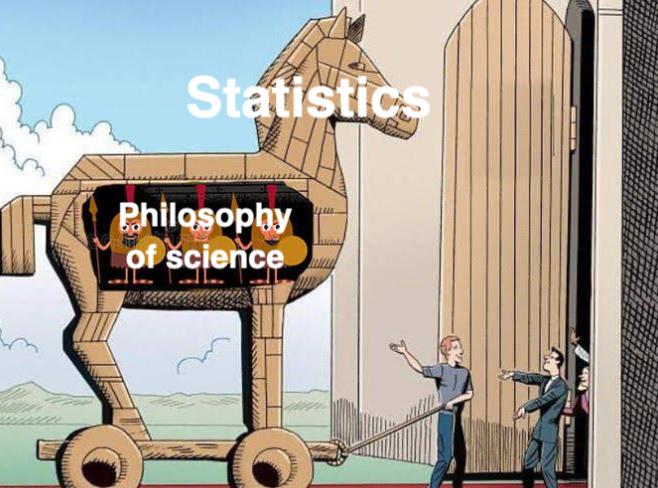

```{r setup, include=FALSE}
knitr::opts_chunk$set(echo = TRUE,
                      fig.width = 6,
                      fig.asp = 0.618,
                      out.width = "70%",
                      fig.align = "center",
                      fig.retina = 3)
```

<link rel="stylesheet" href="https://cdn.rawgit.com/jpswalsh/academicons/master/css/academicons.min.css"/>

Esse conteúdo foi criado com o intuito de despertar o leitor para a importância da Estatística para a ciência e geração de conhecimento. Nossa ideia é apresentar conceitos da maneira que gostaríamos de ter sido apresentados quando alunos prestes a serem iniciados na ciência. Nossa abordagem é simplificar os conceitos o máximo possível sem perder a sua essência. E, quando necessário, aliando-os com sua trajetória histórica para compreensão do "porque as coisas são como são". Não estamos atrás de formalismo matemático, mas sim de conseguir desenvolver uma intuição clara do que é cada conceito, quando se deve usá-lo e quais são os principais cuidados que se deve ter.

A estatística é dividida em duas partes:

1. **Estatística Descritiva**: Sumariza e quantifica as características de uma amostra de dados observados. Métricas comuns são: média, mediana, moda, desvio padrão, variância, correlação, percentis.
2. **Estatística Inferencial**: Permite gerar inferências (afirmações) a partir de um conjunto de uma amostra de dados observados sobre real processo de geração de dados (população). Há diversas maneiras de se gerar tais inferências, mas os principais são os testes de hipóteses clássicos que usam uma hipótese nula $H_0$ pré-especificada. A figura \@ref(fig:graph-estatistica-inferencial) mostra a relação entre dados observados e o processo de geração de dados sob a ótica da probabilidade e da estatística.

```{r graph-estatistica-inferencial, echo=FALSE, out.width='100%', fig.cap='Estatística Inferencial'}
library(DiagrammeR)
grViz("
 digraph estatistica_inferencial {
  forcelabels = true;
  graph [overlap = false,
         fontsize = 12,
         rankdir = TD]
  node [shape = oval,
        fontname = Helvetica]
  A [label = 'Processo de\nGeração de Dados']
  B [label = 'Dados\nObservados']
  A -> B [dir = forward,
          xlabel = '  Probabilidade  ',
          tailport = 'e',
          headport = 'e']
  B -> A [dir = backward,
          label = '  Inferência  ',
          tailport = 'w',
          headport = 'w']
} 
")
```

## Estatística Inferencial

O nosso foco nesse conjunto de tutoriais é focar na **Estatística inferencial**, porque, ao contrário da Estatística descritiva, a Estatística inferencial é raramente compreendida ao ponto do usuário e consumidor estarem aptos à realizar e consumir análises, respectivamente.

A Estatística inferencial têm suas origens no final do século XIX, especialmente no trabalho de Karl Pearson [^13] e se baseia em um conjunto de técnicas e procedimentos para testar hipóteses sobre uma amostra generalizando para uma população-alvo.

[^13]: Matemático inglês que viveu entre 1857-1936. Considerado o fundador do campo da Estatística.

```{r fig-pearson, echo=FALSE, fig.cap='Karl Pearson. Figura de https://www.wikipedia.org', out.extra='class=external'}

```

A chave para compreesão da Estatística inferencial se baseia em entender os testes de hipóteses, também chamado de testes estatísticos. Todos testes estatísticos[^14] segue o mesmo padrão universal [@downey2016]:

[^14]: em especial as técnicas clássicas/frequentistas de Estatística inferencial.

1. **Calculamos uma estatística da amostra**. Aqui estatística (em letras minúsculas) significa uma medida dos dados. Para fins de exemplo vamos chamar essa medida de $\delta$ (letra gregra delta). Essa é a medida que mais nos importamos: uma diferença de média, mediana ou proporções, entre outras... 
2. **Contrastamos essa estatística observada com uma estatística computada se o efeito fosse nulo**. Em outras palavras, o que observamos é comparado com o resultado que esperaríamos caso estívessemos vivendo em um mundo no qual essa medida (diferença de média, mediana ou proporções, ...) fosse nula (zero). Geralmente esse universo paralelo no qual o efeito observado é zero ou nulo é chamado de **Hipótese Nula** e é representada com o seguinte símbolo $H_0$. A estatística $\delta$ no mundo da $H_0$ não é calculada, mas sim dada por um valor que fora matematicamente provado como o valor de $\delta$ no mundo da $H_0$. Vamos chamar esse valor de $\delta_0$
3. **Calculamos a probabidalide de obtermos algo como $\delta$ no mundo da $H_0$**: chamamos isso de $p$-valor. O $p$-valor é a probabilidade de observarmos um $\delta$ no mínimo tão grande quanto o observado num mundo no qual não há o efeito $\delta$. Ou seja $\delta = 0$, e consequentemente $\delta = \delta_0$. Como sabemos do valor $\delta_0$ de antemão, basta compararmos o nosso $\delta$ com $\delta_0$ para gerar o $p$-valor. Por isso que muitos livros de Estatística possuem um vasto arsenal de tabelas. O leitor pode facilmente ver o seu $\delta$ e com alguns dados sobre a amostra, em especial o número da amostra, obter o $\delta_0$ e $p$-valor respectivos.
4. **Decidimos se $\delta$ possui significância estatística**. Escolhemos um limiar de rejeição da $H_0$, muitas vezes chamado de $\alpha$ (letra gregra alpha). Esse limiar será o nosso critério de decisão se há evidências suficientes para rejeitarmos o mundo da $H_0$.

Este paradigma descrito nos quatro passos acima é chamado de *Null Hypothesis Significance Testing* -- NHST (tradução: teste de significância de hipótese nula) e é o que predomina em grande parte da ciência do passado e atual.

Uma segunda chave para a compreensão da Estatística inferencial possui razões históricas. As técnicas de Estatística inferencial clássicas são em grande parte um mecanismo técnico de aproximações numéricas baseadas na distribuição Normal e suas muitas engrenagens subsidiárias. Essa máquina já foi necessária, porque a alternativa conceitualmente mais simples baseada em permutações estava computacionalmente além de nosso alcance[^15]. Antes dos computadores, os estatísticos não tinham escolha [@cobb2007introductory].

<aside>
Quem ficou curioso com a história da Estatística. Recomendo um livro de Stephen Stigler intitulado [Statistics on the Table: The History of Statistical Concepts and Methods](https://www.hup.harvard.edu/catalog.php?isbn=9780674009790). O primeiro autor comprou uma cópia em um sebo online.
</aside>

[^15]: Teoricamente não precisamos da hipótese nula se, no passo 2, simulássemos e permutássemos valores da amostra para calcular um $\delta_0$ (é provado matematicamente que se gerarmos amostras e permutações simuladas o suficiente, conseguiremos ter um $\delta_0$ no mínimo tão verídico que a abordagem clássica) ao invés de nos embasarmos em uma aproximação numérica pré-estabelecida de $\delta_0$. É claro que todas essas permutações e simulações são computacionalmente intensas.

## $p$-valor e Hipótese Nula $H_0$

> $p$-valores são de difícil entendimento, $p < 0.05$.

```{r meme-pvalue, echo=FALSE, out.height='75%'}

```

Sem dúvida, esta parte da Estatística inferencial é a mais complicada e menos intuitiva. Parafraseando Andrew Gelman, estatístico da Columbia University, "Para definir $p$-valores, escolha uma das duas características: intuitiva ou precisa. Ou sua definição é intuitiva mas imprecisa, ou sua definição é precisa mas não intuitiva". A grande maioria dos pesquisadores[^6] possui uma definição incorreta do que é um $p$-valor [@cumming2009inference]. E quando vemos evidências do campo da medicina, que talvez seja o campo com maior quantidade de recursos disponíveis para pesquisa e avanço do conhecimento, também encontramos muitos problemas no uso dos $p$-valores [@Ioannidis2019]. Antes de entrarmos nas definições de $p$-valores, vale a pena tranquilizá-los: $p$-valores são uma coisa complicada e se você não entender na primeira vez que ler as definições abaixo, não se preocupe, você não estará em má companhia; respire fundo e tente novamente.

[^6]: Inclusive muitos renomados e citados em abundância em suas áreas.

**Primeiramente a definição estatística**:

> $p$-valor é a probabilidade de obter resultados no mínimo tão extremos quanto os que foram observados, dado que a hipótese nula $H_0$ é verdadeira.

Se você escrever essa definição em qualquer prova, livro ou artigo científico, você estará 100% preciso e correto na definição do que é um $p$-valor. Agora, a compreensão dessa definição é algo complicado. Para isso, vamos quebrar essa definição em algumas partes para melhor compreensão:

* **"probabilidade de obter resultados..."**: vejam que $p$-valores são uma característica dos seus dados e não da sua teoria ou hipótese.
* **"...no mínimo tão extremos quanto os que foram observados..."**: "no minimo tão" implica em definir um limiar para a caracterização de algum achado relevante, que é comumente chamado de $\alpha$. Geralmente estipulamos alpha em 5% ($\alpha = 0.05$) e qualquer coisa mais extrema que alpha (ou seja menor que 5%) caracterizamos como **significante**[^7].
* **"..dado que a hipótese nula é verdadeira..."**: Todo teste estatístico que possui um $p$-valor possui uma Hipótese Nula (geralmente escrita como $H_0$). Hipótese nula, sempre tem a ver com algum **efeito nulo**. Por exemplo, a hipótese nula do teste Shapiro-Wilk e Komolgorov-Smirnov é "os dados são distribuídos conforme uma distribuição Normal" e a do teste de Levene é "as variâncias dos dados são iguais". Sempre que ver um $p$-valor, se pergunte: "Qual a hipótese nula que este teste presupõe correta?[^8]".

Para entender o $p$-valor qualquer teste estatístico  primeiro descubra qual é a hipótese nula por trás daquele teste. A definição do $p$-valor não mudará. Em todo teste ela é sempre a mesma. O que muda com o teste é a hipótese nula. Cada teste possui sua $H_0$.

[^7]: Cuidado com essa palavra. Ela é precisa e somente deve ser usada em contextos estatísticos. Significância estatística quer dizer que os dados observados são mais extremos que um alpha prédefinido de que a hipótese nula é verdadeira.
[^8]: Esse conselho é extremamente útil. Por diversas vezes temos alunos que nos procuram com uma pergunta mais ou menos assim: "Professor, o que é o teste de *Sobrenome que nunca ouvi falar na minha vida hífen outro sobrenome ainda mais estranho*?". Graças a Wikipedia e Google, nós simplesmente vamos atrás da $H_0$ desse teste (busca Google: "sobrenome1-sobrenome2 null hypothesis") e com isso conseguimos responder ao aluno.

```{r meme-nullhyp, echo=FALSE}
knitr::include_graphics("images/meme-nullhyp.jpg")
```

$p$-valor é a probabilidade dos dados que você obteve dado que a hipótese nula é verdadeira. Para os que gostam do formalismo matemático: $p = P(D|H_0)$. Em português, essa expressão significa "a probabilidade de $D$ condicionado à $H_0$". Antes de avançarmos para alguns exemplos e tentativas de formalizar uma intuição sobre os $p$-valores, é importante ressaltar que $p$-valores dizem algo à respeito dos **dados** e não de **hipóteses**. Para o $p$-valor, **a hipótese nula é verdadeira, e estamos apenas avaliando se os dados se conformam à essa hipótese nula ou não**. Se vocês saírem desse tutorial munidos com essa intuição, o mundo será agraciado com pesquisadores mais preparados para qualificar e interpretar evidências ($p < 0.05$).

**Exemplo intuitivo**:

> Imagine que você tem uma moeda que suspeita ser enviesada para uma probabilidade maior de dar cara. (Sua hipótese nula é então que a moeda é justa.) Você joga a moeda 100 vezes e obtém mais cara do que coroa. O $p$-valor  não dirá se a moeda é justa, mas dirá a probabilidade de você obter pelo menos tantas caras quanto se a moeda fosse justa. É isso - nada mais.

<aside>
Apesar de termos falado anterior que definições intuitivas não são precisas, elas sem dúvida facilitam o entendimento do $p$-valor.
</aside>


### Algumas questões históricas

Não tem como entendermos $p$-valores se não compreendermos as suas origens e trajetória histórica. A primeira menção do termo foi feita pelo estatístico Ronald Fisher[^10] em 1925 [@fisher1925statistical] que define o $p$-valor como um "índice que mede a força da evidência contra a hipótese nula". Para quantificar a força da evidência contra a hipótese nula, Fisher defendeu "$p<0.05$ (5% de significância) como um nível padrão para concluir que há evidência contra a hipótese testada, embora não como uma regra absoluta". Fisher não parou por aí mas classificou a força da evidência contra a hipótese nula. Ele propôs "se $p$ está entre 0.1 e 0.9, certamente não há razão para suspeitar da hipótese testada. Se estiver abaixo de 0.02, é fortemente indicado que a hipótese falha em explicar o conjunto dos fatos. Não seremos frequentemente perdidos se traçarmos uma linha convencional de 0.05" Desde que Fisher fez esta declaração há quase 100 anos, o limiar de 0.05 foi usado por pesquisadores e cientistas em todo o mundo e tornou-se ritualístico usar 0.05 como limiar como se outros limiares não pudessem ser usados.

```{r fig-fisher, echo=FALSE, fig.cap='Ronald Fisher. Figura de https://www.wikipedia.org', out.extra='class=external'}
knitr::include_graphics("images/fisher.jpg")
```

[^10]: A controvérsia da personalidade e vida de Ronald Fisher merece uma nota de rodapé. Suas contribuições, sem dúvida, foram cruciais para o avanço da ciência e da estatística. Seu intelecto era brilhante e seu talento já floresceu jovem: antes de completar 33 anos de idade ele tinha proposto o método de estimação por máxima verossimilhança (*maximum likelihood estimation*) [@stigler2007epic] e também criou o conceito de graus de liberdade (*degrees of freedom*) ao propor uma correção no teste de chi-quadrado de Pearson [@Baird1983]. Também inventou a Análise de Variância (ANOVA) e foi o primeiro a propor randomização como uma maneira de realizar experimentos, sendo considerado o "pai" dos ensaios clínicos randomizados. Nem tudo é florido na vida de Fisher, ele foi um eugenista e possuía uma visão muito forte sobre etnia e raça preconizando a superioridade de certas etnias. Além disso, era extremamente invariante, perseguindo, prejudicando e debochando qualquer crítico à suas teorias e publicações. O que vemos hoje no monopólio do paradigma Neyman-Pearson com $p$-valores e hipóteses nulas é resultado desse esforço Fisheriano em calar os críticos e deixar apenas sua voz ecoar.

Após isso, o limiar de 0.05 agora instaurado como inquestionável influenciou fortemente a estatística e a ciência. Mas não há nenhuma razão contra a adoção de outros limiares ($\alpha$) como 0.1 ou 0.01. Se bem argumentados, a escolha de limiares diferentes de 0.05 pode ser bem-vista por editores, revisores e orientadores. Como o $p$-valor é uma probabilidade, ele não é um quantidade contínua. Não há razão para diferenciarmos um $p$ de 0.049 contra um $p$ de 0.051. Robert Rosenthal, um psicólogo já dizia "Deus ama $p$ de 0.06 tanto quanto um $p$ de 0.05" [@rosnow1989statistical].

```{r stats-pvalue-meme, echo=FALSE}

```

### O que o $p$-valor não é

Com a definição e intuição do que é um $p$-valor bem ancoradas, podemos avançar para o que o $p$-valor **não é**!

```{r meme-pvalue2, echo=FALSE}

```


1. **$p$-valor não é a probabilidade da Hipótese nula** - Famosa confusão entre $P(D|H_0)$ e $P(H_0|D)$. $p$-valor não é a probabilidade da hipótese nula, mas sim a probabilidade dos dados que você obteve. Por exemplo: a probabilidade de você tossir dado que você está com COVID é diferente da probabilidade de você estar com COVID dado que você tossiu: $P(\text{tosse} | \text{COVID}) \neq P(\text{COVID} | \text{tosse})$. Acredito que a primeira, $P(\text{tosse} | \text{COVID})$ é bem alta, enquanto a segunda, $P(\text{COVID} | \text{tosse})$ deve ser bem baixa (afinal tossimos a todo momento).

<aside>
O primeiro autor tentou explicar essa diferença para uma senhora que o viu tossir na fila do mercado, mas os seus esforços foram em vão...
</aside>

2. **$p$-valor não é a probabilidade dos dados serem produzidos pelo acaso** - Não! Ninguém falou nada de acaso. Mais uma vez: $p$-valor é probabilidade de obter resultados no mínimo tão extremos quanto os que foram observados, dado que a hipótese nula é verdadeira.

3. **$p$-valor mensura o tamanho do efeito de um teste estatístico** - Também não... $p$-valor não diz nada sobre o tamanho do efeito. Apenas sobre se o quanto os dados observados divergem do esperado sob a hipótese nula. É claro que efeitos grandes são mais prováveis de serem estatisticamente significantes que efeitos pequenos. Mas isto não é via de regra e nunca julguem um achado pelo seu $p$-valor, mas sim pelo seu tamanho de efeito. Além disso, $p$-valores podem ser "hackeados" de diversas maneiras [@head2015extent] e muitas vezes seu valor é uma consequência direta do tamanho da amostra. Mais sobre isso no [conteúdo auxiliar sobre tamanho de amostra](aux-Tamanho_Amostra.html).

### Intervalos de Confiança

Intervalos de confiança foram criados como uma solução para os problemas de má-interpretação dos $p$-valores e sua aplicação se destina ao **tamanho do efeito**. Se você achou $p$-valor confuso, se prepare! Intervalos de confiança são ainda mais confusos...Vamos para a definição estatística:

> Intervalo de confiança é o intervalo de valores que incluem um valor de uma população com um certo nível de confiança.

Mais uma vez vamos quebrar essa definição em em algumas partes para melhor compreensão:

* "... intervalo de valores ...": intervalo de confiança sempre serão **expressados como um intervalo** $a$ - $b$, onde $a$ é menor que $b$ ($a < b$).
* "... incluem um valor de uma população...": aqui estamos falando de população. E o que você geralmente tem nas suas mãos quando está fazendo uma análise estatística é uma amostra. Uma população é um conjunto de pessoas, itens ou eventos sobre os quais você quer fazer inferências. Uma amostra é um é um subconjunto de pessoas, itens ou eventos de uma população maior que você coleta e analisa para fazer inferências. Geralmente o tamanho da amostra é bem menor que o tamanho da população[^11]. Então, **intervalos de confiança expressam a frequência de longo-prazo que vocês esperaria obter de um tamanho de efeito caso replicasse o teste estatístico para diversas amostras da MESMA população**.
* ".. com um certo nível de confiança": sempre os intervalos de confiança serão expressados **acompanhados de uma probabilidade** (algo entre 0.001% e 99.999%) que quantifica a certeza de encontrar o intervalo em uma replicações do teste estatístico para diversas amostras da MESMA população.

[^11]: Boa parte dos teoremas matemáticos por trás da Estatística inferencial se baseiam em "convergências em distribuição" que é uma maneira de expressarmos que a media que o tamanho da população tende ao infinito, $n \to \infty$, certas variáveis aleatórias convergem para uma certa distribuição. Um belo exemplo é o teorema do limite central. Um bom trabalho que crítica o alicerce da Estatística inferencial ser baseado em convergências quando a população tende ao infinito e propõem adotar alicerces baseados em desigualdades probabilísticas é @taleb2020statistical.

Por exemplo: digamos que você executou uma análise estatística para comparar eficácia de uma política pública em dois grupos e você obteve a diferença entre a média desses grupos. Você pode expressar essa diferença como um intervalo de confiança. Geralmente escolhemos a confiança de 95% (sim, está relacionado com o 0.05 do $p$-valor). Você então escreve no seu artigo que a "diferença entre grupos observada é de 10.5 - 23.5 (95% IC)". Isso quer dizer que **95 estudos de 100, que usem o mesmo tamanho de amostra e população-alvo, aplicando o mesmo teste estatístico, esperarão encontrar um resultado de diferenças de média entre grupos entre 10.5 e 23.5**. Aqui as unidades são arbitrárias, mas para continuar o exemplo vamos supor que sejam espectativa de vida.

Intervalos de confiança estão profundamente relacionados com $p$-valores. Primeiro, para que uma estimativa tenha um $p$-valor menor que 0.05, seu intervalo de confiança 95% não pode capturar o zero. Ou seja, o intervalo não pode compreender o efeito nulo (Hipótese Nula - $H_0$). Isso segue para outros valores de $p$ correspondentes com outros níveis de confiança dos intervalos. Por exemplo, para uma estimativa com $p$-valor menor que 0.01, seu intervalo de confiança 99% não pode capturar o 0. Além disso, intervalos de confiança (assim como $p$-valores) estão intrinsicamente conectados com o tamanho da amostra. Quanto maior o tamanho de amostra, mais estreito será o intervalo de confiança. A intuição por trás disso é que conforme a sua amostra aumenta, também aumentarão a sua confiança e precisão em inferências sobre a população-alvo. Por fim, intervalos de confiança (assim como $p$-valores) não falam nada sobre a sua teoria ou hipótese, mas sobre a relação dos seus dados (amostra) com a população-alvo. Eles **não são a probabilidade do parâmetro estimado ($P(\text{parâmetro} | D)$, no nosso exemplo diferença entre médias de grupos), mas sim a probabilidade de amostras com o mesmo parâmetro estimado ($P(D | \text{parâmetro})$)**.

Uma boa maneira de resumir $p$-valores e intervalos de confiança é a seguinte:

> Considere $p$-valores algo que mensura a possibilidade de existir um efeito ou não e intervalos de confiança quantificam o tamanho desse efeito.

<aside>
Mas sempre se atente nas definições. Lembre-se que se tentarmos ser intuitivos com $p$-valores e intervalos de confiança não seremos precisos nas definições.
</aside>

### Significância Estatística vs Significância Prática

<aside>
Considere isso uma introdução rápida à $p$-hacking.
</aside>

Para encerrar esse tour de $p$-valores e intervalos de confiança, temos que nos atentar que **significância estatística não é a mesma coisa que significância prática**. Significância estatística é se algum achado de um teste/modelo estatístico diverge o suficiente da hipótese nula e, sendo que hipótese nula sempre são sobre efeitos ou diferenças nulas, podemos afirmar que significância estatística quer dizer um achado é diferente de um efeito nulo. **Diversos testes da Estatística inferencial clássica quando submetidos à amostras grandes[^12] vão detectar uma diferença significante, mesmo que praticamente insignificante**. Com uma amostra suficientemente grande nós conseguimos gerar $p$-valores significantes para diferenças minúsculas, como por exemplo uma diferença de 0.01cm altura entre dois grupos de uma amostra.

[^12]: O que é muito comum em 2020s com o advento de Big Data e facilidade de obtenção de dados.

Por isso que defendemos que nunca se interprete análises estatísticas somente com $p$-valores, mas sempre em conjunto com os intervalos de confiança que quantificam o tamanho do efeito. **Nunca gere argumentos sobre evidências somente a partir de significância estatística, sempre inclua tamanho do efeito**.

## Erro Tipo I e Erro Tipo II

Na Estatística inferencial temos dois erros possíveis quando estamos realizando um teste estatístico contra uma hipótese nula.

* **Erro tipo I**, também chamado de **"falso positivo"**, é a chance de rejeitarmos a hipótese nula quando ela é verdadeira. Esse erro é o alpha $\alpha$ que é usado como limiar de significância do $p$-valor.
* **Erro tipo II**, também chamado de **"falso negativo"**, é a chance de não rejeitarmos a hipótese nula quando ela é falsa. Esse erro é identificado como a letra grega beta $\beta$. Além disso, o **poder** de um teste estatístico é mensurado como $1 - \beta$. O poder de um teste estatístico aumenta proporcionalmente ao tamanho amostral. Quanto maior a amostra, maior o poder do teste.

<aside>
Esses conceitos foram criados por matemáticos, então a nomenclatura erro tipo I e erro tipo II é perfeita matematicamente, pois no contexto de testes estatísticos contra uma hipótese nula só existem dois tipos de erros. Mas para o ensino da Estatística e comunicação de incertezas é péssima. Sempre que possível optamos por usar termos como "falso positivo" e "falso negativo" ao invés de erro tipo I e erro tipo II.
</aside>

```{r errors, echo=FALSE}
knitr::include_graphics("images/errors.jpg")
```

Por questões históricas, o erro tipo I [^20] foi considerado mais importante de ser controlado do que o erro tipo II. Portanto, quase todos os testes de hipótese nula focam no controle dos "falsos positivos" enquanto o controle dos "falsos negativos" são colocados em segundo plano. No mundo ideal, tanto $\alpha$ quando $\beta$ devem ser reduzidos o máximo possível. Isto requer um tamanho amostral frequentemente maior do que os recursos disponíveis para o pesquisador, portanto é comum pesquisadores usarem um $\alpha$ de 5% e um $\beta$ de 20% (poder de 80%).

[^20]: Jerzy Newman, fundador do paradigma NHST, e criador dos erros tipo I e tipo II defendia a ideia de que é melhor absolver um culpado (erro tipo II) do que culpar um inocente (erro tipo I).

## Tamanho da Amostra

A maioria dos testes estatísticos que computam um $p$-valor são extremamente sensíveis a tamanho da amostra. A hipótese nula sempre representa a ausência de qualquer efeito e *nunca* a diferença observada na amostra é igual a zero. Sempre há algum digito, menor que seja, que faz com que a diferença seja diferente de zero, ex: 0.00001. Quanto maior o tamanho da amostra maior a probabilidade de obtermos um $p$-valor significante, pois ele indica que o efeito é diferente de zero, mesmo que essa diferença seja insignificante do ponto de vista prático. Em certos contextos, defendemos que o $p$-valor é uma aproximação (*proxy*) de tamanho da amostra.

```{r sample-size, echo=FALSE}

```

## Pressupostos

Antes de avançarmos, é necessário clarificar algo que muitos pesquisadores e cientistas não se atentam e acaba invalidando diversas análises[^1]: pressupostos das técnicas estatísticas clássicas. Lembrando que as técnicas estatísticas clássicas são "um mecanismo técnico de aproximações numéricas baseadas na distribuição Normal e suas muitas engrenagens subsidiárias", e, como consequência, essas aproximações numéricas se baseiam em um forte pressuposto sobre os dados da amostra. **Os três principais pressupostos são: independência, normalidade e homogeneidade das variâncias**. Se algum desses três pressupostos são violados, é sinal que sua análise requer atenção. Geralmente a escolha de uma técnica que é robusta à certas violações de pressupostos é o caminho ideal a ser trilhado[^16].

[^16]: Algumas vezes isso não é possível e precisamos recorrer a transformações dos dados, ou até mesmo uma recoleta de dados.

Além disso, tamanho da amostra também é um problema comum em análises estatísticas. Tamanho da amostra não é um pressuposto em si[^17], mas pode invalidar muitas análises e é um dos principais critérios de rejeição de artigos.

[^17]: Alguns testes demandam no mínimo 20 observações para serem válidas. O número 20 possui relação com a derivação da distribuição Normal como uma distribuição binomial na qual o tamanho amostral é maior que 20.

```{r assumptions, echo=FALSE, out.width='75%'}
knitr::include_graphics("images/assumptions.jpeg")
```

### Independência dos Dados

Primeiramente, para quase toda a estatística inferencial, temos o pressuposto de **independência dos dados**. Isso é valido para teste $t$, ANOVA, regressões, entre outros... O pressuposto de independência dos dados quer dizer que o valor de uma observação não influencia ou afeta o valor de outras observações. Caso você encontre dados que violam esse pressuposto, é necessário de alguma maneira incorporar tal dependência na sua análise[^3]. Fontes comuns de não-independência são[^2]:

[^1]: Não estamos exagerando, quando você aprender o que são os pressupostos de cada técnica estatística vai começar a identificar que muitos artigos por aí não estão nem aí para pressupostos.
[^3]: Isso geralmente requer o uso de técnicas especificamente criadas para dados que natualmente possuem um certo tipo de dependência.
[^2]: Análises de séries temporais e análises de dados geoespaciais fazem parte de um projeto futuro nosso.

* **Dependência Temporal**: O valor de uma observação é influenciado pela dimensão temporal. Muito comum em séries temporais, tais como dados financeiros e econômicos. Nesse caso, o ideal é tentar incluir a dimensão temporal na sua análise.
* **Dependência Espacial**: O valor de uma observação é influenciado pela dimensão espacial. Muito comum em dados geoespaciais e georeferenciados. Aqui, o ideal é incorporar a dimensão espacial na sua análise.

<aside>
Dependência temporal e espacial não são os únicos tipos de dependências que existem nos dados. Se as observações tiverem algum tipo de relação que faz com que uma influencie a outra, considere o pressuposto de independência dos dados violado.
</aside>

Se esse pressuposto for violado, as técnicas clássicas de Estatística inferencial não serão válidas na sua análise. Sugerimos que você tente remover a fonte de dependência dos dados, recoletar os dados de maneira que não sejam geradas fontes de dependência, ou empregar técnicas que consigam incorporar a fonte de dependência na análise.

### Normalidade

Dados normais são dados que seguem uma distribuição Normal, também conhecida por distribuição Gaussiana[^4]. Uma variável distribuída como uma distribuição Normal segue aquela forma clássica de sino. Mais especificamente, esse pressuposto de normalidade geralmante se aplica somente à variável dependente. Abaixo um exemplo de variável Normal.

[^4]: Homenagem a [Carl Friedrich Gauss](https://en.wikipedia.org/wiki/Carl_Friedrich_Gauss), matemático Alemão que viveu entre 1777 e 1855.

<aside>
Variável dependente é aquela que estamos interessados na nossa análise. É a variável que se altera conforme outras variáveis (chamadas de independentes) se alteram.
</aside>

```{r dist-normal, message=FALSE, fig.cap='Distribuição Normal'}
library(ggplot2)
library(dplyr)
tibble(x = c(-4, 4)) %>% 
ggplot(aes(x)) + 
    stat_function(size = 3, col = "red", fun = dnorm) +
  labs(
    x = NULL,
    y = NULL
  )
```

#### Como eu sei que minha variável dependente é Normal?

Muitos gostam de plotar um gráfico para ~~bisolhar~~ estimar se uma varíavel segue uma distribuição Normal ou não. Somos adeptos de visualizações e usamos constantemente nas nossas análises. Mas, na Estatística, as visualizações são muito boas para mostrar alguma tendência, característica ou peculiaridade dos dados. Agora, para **provar** algo é necessário um teste estatístico.

Há dois testes estatísticos para saber se uma variável é distribuída conforme uma distribuição Normal: Komolgorov-Smirnov e Shapiro-Wilk. Ambos possuem como hipótese nula ($H_0$) que "os dados são distribuídos conforme uma distribuição Normal".

#### Komolgorov-Smirnov vs Shapiro-Wilk

Ambos os testes aceitam como input uma variável e dão como output um $p$-valor. Mas qual usar? Estudos comparativos [@saculinggan2013empirical] de diferentes testes de normalidade demonstram que Shapiro-Wilk é o teste com maior poder estatístico[^5].

[^5]: Poder estatístico é,  para uma certa probabilidade de erro tipo I ($\alpha$), 1 menos a probabilidade de erro tipo II ($1 - \beta$). Veja mais no [conteúdo auxiliar de Tamanho da Amostra](aux-Tamanho_Amostra.html).

Abaixo, no R, vamos simular 1.000 observações de uma variável distribuída conforme uma distribuição Normal com média 0 e desvio padrão 1. Além disso, vamos simular também 100 observações de uma variável bem longe de ser distribuída como uma distribuição Normal. Vamos usar uma variável distribuída conforme uma distribuição Log-Normal. Primeiramente, vamos mostrar graficamente as duas distribuições. Como vocês podem na figura \@ref(fig:dists-norm-lnorm), a distribuição Normal tem a forma característica de sino e a distribuição Log-Normal tem uma assimetria para a direita com uma cauda mais alongada.

```{r dists-norm-lnorm, fig.cap='Distribuição Normal vs Distribuição Log-Normal'}
tibble(x = c(-8, 8)) %>% 
ggplot(aes(x)) + 
  stat_function(size = 3, col = "red", fun = dnorm) +
  stat_function(size = 3, col = "blue", fun = dlnorm) +
  labs(
    x = NULL,
    y = NULL
  )
```

Agora com as simulações! Na figura \@ref(fig:simulacoes-normalidade) é possível ver o histograma das distribuições simuladas. Em vermelho temos o histograma das 1.000 amostragens de uma distribuição Normal e, em azul da distribuição Log-Normal.

```{r simulacoes-normalidade, fig.cap='Histograma das Simulações de Normalidade'}
set.seed(123)
n_sim <- 1000
sims <- tibble(
  normal = rnorm(n_sim),
  log_normal = rlnorm(n_sim)
)

ggplot(sims) +
  geom_density(aes(normal, fill = "Normal"), alpha = 0.5) +
  geom_density(aes(log_normal, fill = "Log-Normal"), alpha = 0.5) +
  labs(y = NULL, x = NULL) +
  scale_fill_manual(name = "Distribuição", values = c("Normal" = "red", "Log-Normal" = "blue")) +
  theme(legend.position = "bottom")
```

#### Teste de Shapiro-Wilk

O teste de Shapiro-Wilk está disponível como padrão no R pela função `shapiro.test()` que aceita uma variável como input.

```{r shapiro-wilk}
shapiro.test(sims$normal)
shapiro.test(sims$log_normal)
```

Sobre o $p$-valor que aparece como resultado do teste, $p < 0.05$ ($p$ menor que 0.05) significa fortes evidências de que a variável testada não segue uma distribuição Normal.

<aside>
Em outras palavras, rejeita-se a hipótese nula $H_0$.
</aside>

#### Teste de Komolgorov-Smirnov

Adicionalmente mostramos como fazer um teste Komolgorov-Smirnof, também disponível como padrão no R pela função `ks.test()`. Aqui temos que ser um pouco mais específico pois o teste exige a especificação exata do que se quer comparar. No caso, estamos informando que a distribuição a ser testada contra é uma Normal `"pnorm"` e usamos os valores de média `mean()` e desvio padrão `sd()` da variável que estamos testando. Lembrando que a definição do $p$-valor para este teste é a mesma do Shapiro-Wilk.

```{r komolgorov-smirnov}
ks.test(sims$normal, "pnorm", mean(sims$normal), sd(sims$normal))
ks.test(sims$log_normal,  "pnorm", mean(sims$log_normal), sd(sims$log_normal))
```

### Homogeneidade das Variâncias

Também chamado de homocedasticidade, homogeneidade das variâncias é um pressuposto que, para uma dada mensuração, a variação dessa mensuração dentro de estratos/grupos da sua amostra é similar. Em outras palavras, se você possui três grupos de indivíduos e está mensurando a altura, a variação da altura dentre os três grupos não pode ser muito diferentes entre os três grupos.

Uma boa maneira de visualizar isso é usarmos distribuições Normais com diferentes médias e desvio padrões. No caso de homogeneidade das variâncias, conseguimos visualizá-la com três distribuições Normais, sendo que todas possuem o mesmo desvio padrão, mas diferentes médias. Esse seria o gráfico da esquerda na figura \@ref(fig:dists-norm-homogeneidade). Já no caso de heterogeneidade, conseguimos demonstrar usando as mesmas três distribuições Normais mas agora introduzindo diferentes desvios padrões. Esta situação é o gráfico da direita na figura \@ref(fig:dists-norm-homogeneidade)

```{r dists-norm-homogeneidade, fig.cap='Homogeneidade e Heterogeneidade das Variâncias', layout='l-page'}
library(patchwork)
p1 <- ggplot(data.frame(x = c(-4, 4)), aes(x)) + 
  mapply(function(mean, sd, col) {
    stat_function(fun = dnorm, args = list(mean = mean, sd = sd), size = 3, col = col)
  }, 
  # enter means, standard deviations and colors here
  mean = c(0, 1, -1), 
  sd = c(1, 1, 1), 
  col = c('red', 'blue', 'green')
)

p2 <- ggplot(data.frame(x = c(-4, 4)), aes(x)) + 
  mapply(function(mean, sd, col) {
    stat_function(fun = dnorm, args = list(mean = mean, sd = sd), size = 3, col = col)
  }, 
  # enter means, standard deviations and colors here
  mean = c(0, 1, .5), 
  sd = c(1, .5, 2),  
  col = c('red', 'blue', 'green')
)

p1 | p2
```

Há dois testes estatísticos para saber se uma variável possui variâncias homogêneas conforme seus diferentes grupos ou estratos: Bartlett e Levene. Ambos possuem como hipótese nula ($H_0$) que "as variâncias dos grupos/estratos são iguais". O teste de Bartlett é baseado na média dos grupos, portanto é influenciado por observações extremas (também chamadas de *outliers*). Já o teste de Levene é baseado na mediana dos grupos, o que faz com que seja robusto à *outliers*. Nós recomendamos que sempre usem o teste de Levene por conta de ser mais robusto que o teste de Bartlett.

Para mostrarmos ambos os testes, mais uma vez usararemos simulações. Aqui vamos gerar um *dataset* de `r n_sim/2` observações em dois grupos: `A` com `r n_sim/4` e `B` com `r n_sim/4` observações. E vamos considerar dois cenários: o primeiro onde temos médias diferentes entre os grupos mas homogeneidade de variâncias (possuem o mesmo desvio padrão) e o segundo onde temos médias diferentes entre os grupos e com heterogeneidade de variâncias (possuem desvio padrões diferentes). Ambos cenários podem ser visualizados na figura \@ref(fig:simulacoes-homogeneidade).

```{r simulacoes-homogeneidade, fig.cap='Histograma das Simulações de Homogeneidade das Variâncias', layout='l-page', message=FALSE, warning=FALSE}
sims2 <- tibble(
  group = c(rep("A", n_sim/4), rep("B", n_sim/4)),
  homog = c(rnorm(n_sim/4, 0, 1), rnorm(n_sim/4, 1, 1)),
  heterog = c(rnorm(n_sim/4, 0, 0.1), rnorm(n_sim/4, 1, 2))
)

p3 <- ggplot(sims2, aes(homog, fill = group)) + 
  geom_density(alpha = 0.5, show.legend = F)

p4 <- ggplot(sims2, aes(heterog, fill = group)) + 
  geom_density(alpha = 0.5, show.legend = F)

p3 | p4
```

#### Teste de Bartlett

O teste de Barlett está disponível como padrão no R pela função `bartlett.test()`. Como estamos trabalhando com um *dataset* que possui duas variáveis: uma que é a que queremos testar a homogeneidade e outra que representa os grupos ou estratos; geralmente usamos a síntaxe de fórmula no R. A fórmula é designada pela seguinte síntaxe: `variavel ~ grupo`.

Você tem que passar dois argumentos para a função `bartlett.test()`:

1. Fórmula designando qual variável deve ser analisada a homogeneidade das variâncias em quais grupos.
2. O *dataset* no qual deverá ser encontrados tanto a varíavel quanto os grupos.

```{r bartlett, warning=FALSE}
bartlett.test(homog ~ group, data = sims2)
bartlett.test(heterog ~ group, data = sims2)
```

Sobre o $p$-valor que aparece como resultado do teste de Bartlett, $p < 0.05$ ($p$ menor que 0.05) significa fortes evidências de que a variável testada não possui homogeneidade de variâncias para os grupos especificados.

<aside>
Em outras palavras, rejeita-se a hipótese nula $H_0$.
</aside>

#### Teste de Levene

O teste de Levene está disponível na biblioteca `{car}` [@car] na função `leveneTest()` e você tem que passar dois argumentos:

1. Fórmula designando qual variável deve ser analisada a homogeneidade das variâncias em quais grupos.
2. O *dataset* no qual deverá ser encontrados tanto a varíavel quanto os grupos.

<aside>
`{car}` não tem nada a ver com carros. Ele é um acrônimo para "Companion to Applied Regression" e é uma biblioteca com funções para acompanhar um livro intitulado "An R Companion to Applied Regression" de Fox & Weisberg. Ele tem diversas funções interessantes e testes estatísticos que não estão disponíveis como padrão no R.
</aside>

```{r levene, warning=FALSE}
library(car)
leveneTest(homog ~ group, data = sims2)
leveneTest(heterog ~ group, data = sims2)
```

Sobre o $p$-valor que aparece como resultado do teste de Levene, $p < 0.05$ ($p$ menor que 0.05) significa fortes evidências de que a variável testada não possui homogeneidade de variâncias para os grupos especificados.

<aside>
Em outras palavras, rejeita-se a hipótese nula $H_0$.
</aside>

## Correlação versus Causalidade

Correlação não é causalidade. Talvez você já tenha ouvido falar nessa expressão. Os testes estatísticos não sabem diferenciar de correlação com causalidade, eles apenas testam se o efeito não é nulo. Cabe ao pesquisador inferir se as consequências são causais ou associativas.

```{r correlation-causation, echo=FALSE}
knitr::include_graphics("images/correlation-causation.png")
```

Muitas vezes quando ensinamos Estatística, passamos muito tempo discutindo filosofia da ciência ao invés de Estatística. Coisas como "ausência de evidência não é evidência de ausência" viram focos de longas discussões. Causalidade é um campo da Estatística que está em grande destaque atualmente e acreditamos que irá revolucionar a maneira que enxergamos causalidade num futuro próximo [^21]. Mas, enquanto esta revolução não chega, adotamos o seguinte posicionamento: causalidade, para nós, implica em controlar totalmente um ambiente por meio de um experimento e introduzir uma intervenção por meio da manipulação de **uma única variável**. Somente assim conseguimos atribuir causalidade ao resultado de um teste estatístico. Caso contrário, estamos ainda sob o domínio da associação.

[^21]: Caso o leitor se interesse pelo tema, sugerimos um livro de Judea Pearl ganhador do Prêmio Turing (Nobel da computação): @pearl2009causality.

```{r stat-phil, echo=FALSE}

```

## Comentários Finais

Sim, $p$-valores, intervalos de confiança, hipóteses nulas são conceitos complexos e muitos pesquisadores e cientistas não possuem a compreensão mínima necessária para a prática de Estatística inferencial. Acreditamos que a ciência (e a sociedade como um todo) se beneficiará de um maior número de cidadãos e pesquisadores que consigam avaliar, quantificar e qualificar evidências científicas. O paradigma da evidência científica atual (e, acreditamos que perdurará assim por bastante tempo) é o NHST e, apesar de termos algumas alternativas -- como a Estatística Bayesiana -- NHST irá predominar em boa parte da ciência pelas próximas décadas. Por isso, caro leitor, saiba que com "grandes poderes, vêm grandes responsabilidades". Não deixe alguém torturar dados em práticas anti-éticas de *$p$-hacking* ou fundamentarem seus argumentos em compreensões incorretas de $p$-valor e $H_0$.

<aside>
Há uma abordagem de Estatística inferencial que não se baseia em hipóteses nulas e $p$-valores: a Estatística Bayesiana. Caso fiquem curiosos o primeiro autor possui uma [disciplina *opensource* de Estatística Bayesiana com R](https://storopoli.github.io/Estatistica-Bayesiana/).
</aside>

```{r great-power, echo=FALSE}
knitr::include_graphics("images/great-power.jpg")
```

## Ambiente

```{r SessionInfo}
sessionInfo()
```
