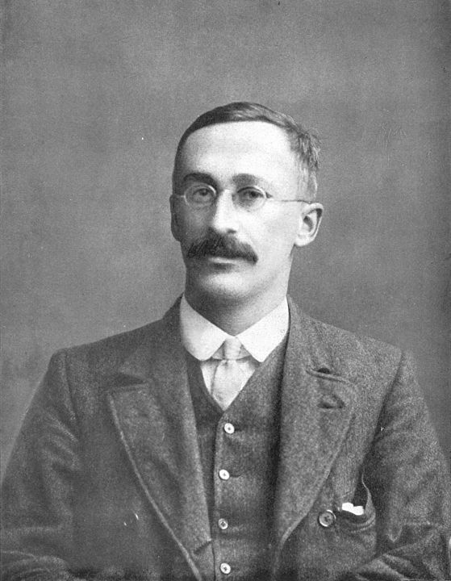

```{r setup, include=FALSE}
knitr::opts_chunk$set(echo = TRUE,
                      fig.width = 6,
                      fig.asp = 0.618,
                      out.width = "70%",
                      fig.align = "center",
                      fig.retina = 3)
```

<link rel="stylesheet" href="https://cdn.rawgit.com/jpswalsh/academicons/master/css/academicons.min.css"/>

Todos os testes aqui descritos possuem uma única finalidade: **identificar se a média de variável entre dois grupos é diferente**. Todos possuem como **hipótese nula a diferença entre os grupos é zero**, então $p$-valores oriundos dos testes quantificam a probabilidade de você obter resultados tão extremos caso não haja diferença entre os grupos. Por fim, todos os testes possuem o **pressuposto de independência dos dados**, portanto, caso haja alguma fonte de dependência dos dados os resultados dos testes são inválidos.

## Teste $t$ de Student

William Sealy Gosset (químico, 1876-1937) publicou o teste $t$ sob o pseudônimo de "Student", razão pela qual o teste às vezes é chamado de "teste $t$ de Student" [@studentProbableErrorMean1908]. Há controvérsia sobre a origem e o significado de $t$. Uma hipótese é que $s$ era comumente usado na época para se referir a estatísticas de amostra, então Gosset escolheu $t$ como a próxima letra, talvez indicando um “avanço” no pensamento sobre estatísticas de amostra. Gosset publicou sob um pseudônimo porque ele era um funcionário da Cervejaria Guinness na época, e ele foi contratado para examinar questões ao fazer inferências sobre pequenas amostras na fabricação de cerveja. O teste que ele desenvolveu poderia ser propriedade intelectual do Guinness, mas Gosset achou que o teste poderia ser amplamente usado, então ele o publicou sob um pseudônimo para proteger seu trabalho.

```{r fig-gosset, echo=FALSE, fig.cap='William Sealy Gosset. Figura de https://www.wikipedia.org', out.extra='class=external'}

```


O teste $t$ de Student **assume os seguintes pressupostos com relação aos dados**:

1. **Os dados são independentes**: o valor de uma observação não influencia ou afeta o valor de outras observações.
2. **A variável dependente (aquela que estamos usando para calcular a média dos grupos) é distribuída conforme uma distribuição Normal.**
3. **A variável dependente possui homogeneidade de variância dentre os grupos**[^13].

<aside>
Lembre-se que uma vez violados esses pressupostos, os resultados do teste $t$ são inválidos.
</aside>

[^13]: Uma versão do teste $t$ de Welch é robusta a heterogeneidade de variâncias e permite com que esse pressuposto seja violado.

### Student vs Welch

Em 1947, Bernard Lewis Welch, estatístico britânico adaptou o teste $t$ de Student para ser robusto perante heterogeneidade das variâncias [@welch1947generalization]. O teste $t$ de Welch é muita vezes confudido e reportado erroneamente como teste $t$ de Student, uma vez que pela sua robustez é o teste $t$ padrão de diversos softwares estatísticos [@delacre2017psychologists]. No R a função `t.test()` possui como padrão o teste $t$ de Welch e caso você queira explicitamente usar o teste $t$ de Student você deve incluir o argumento `var.equal = TRUE` na função.

### Teste $t$ para Amostras Independentes

Quando temos dois grupos na mesma amostra, usamos o teste $t$ para amostras independentes. A função `t.test()` é incluída como padrão no R. Aqui vamos simular dois grupos `A` e `B` cada um com 20 observações e vamos amostrar de uma distribuição Normal para cada um dos grupos com médias diferentes.

A fórmula que deve ser passada na função `t.test()` segue a mesma lógica das fórmulas do Teste de Bartlett e de Levene, sendo que é necessário tem que passar dois argumentos:

1. Fórmula designando a variável cuja média deve ser analisada e os grupos em relação aos quais as médias serão analisadas. A fórmula é designada pela seguinte síntaxe: `variavel ~ grupo`.
2. O *dataset* no qual deverá ser encontrados tanto a varíavel quanto os grupos.

O resultado para a simulação é um $p$-valor menor que 0.05, ou seja um resultado significante apontando que podemos rejeitar a hipótese nula (fortes evidências contrárias que as médias dos grupos são iguais).

```{r teste-t}
library(ggplot2)
library(dplyr)
n_sim_t <- 20
sim3 <- tibble(
  group = c(rep("A", n_sim_t), rep("B", n_sim_t)),
  measure = c(rnorm(n_sim_t, mean = 0), rnorm(n_sim_t, mean = 5))
)

t.test(measure ~ group, data = sim3)
```
<aside>
Notem que a saída da função `t.test()` possui um intervalo de confiança 95% (padrão, mas pode ser mudado)
</aside>

### Teste $t$ para duas Amostras Pareadas

Em agumas situações temos amostras pareadas, como por exemplo quando fazemos uma mensuração antes e depois de algum acontecimento ou intervenção. Para isso a função `t.test()` tem o argumento `paired` que quando definido como `TRUE` faz com que o teste $t$ seja pareado.

A mesma simulação do teste $t$ para amostras pareadas, mas agora não usamos a fórmula e passamos como argumento as mensurações das duas amostras pareadas:

```{r teste-t-pareado}
amostra_1 <- tibble(measure = rnorm(n_sim_t, mean = 0))
amostra_2 <- tibble(measure = rnorm(n_sim_t, mean = 5))

t.test(amostra_1$measure, amostra_2$measure, paired = TRUE)
```
<aside>
Notem que a saída da função `t.test()` possui um intervalo de confiança 95% (padrão, mas pode ser mudado)
</aside>

## Testes $t$ Não-Paramétricos

O que fazer se meus dados violam o princípio da normalidade? Nesse caso devemos usar uma abordagem **não-paramétrica**. O teste $t$ de Student (e também de Welch) é uma abordagem paramétrica: dependem fortemente da suposição que os dados estejam distribuídos de acordo com uma distribuição específica. Testes não-paramétricos não fazem suposições sobre a distribuição dos dados e portanto podem ser usados quando os pressupostos dos testes paramétricos são violados.

**Atenção**: testes não-paramétricos são menos sensíveis em rejeitar a hipótese nula quando ela é verdadeira (erro tipo I) do que testes paramétricos quando o pressuposto de normalidade não é violado [@zimmerman1998nonparametric]. Então não pense que deve sempre aplicar um teste não-paramétrico em todas as ocasiões.

### Teste de Mann–Whitney

O teste de Mann-Whitney foi desenvolvido em 1947 para ser uma alternativa não-paramétrica ao teste $t$ para amostras independentes [@mann1947]. Para aplicar o teste Mann-Whitney use a função `wilcox.test()`[^14] é incluída como padrão no R. Aqui vamos simular novemente dois grupos `A` e `B` cada um com 20 observações e vamos amostrar de uma distribuição Log-Normal para cada um dos grupos com médias diferentes. A síntaxe é a mesma que a função `t.test()`.

[^14]: O teste Mann-Whitney também e chamado de teste de Mann–Whitney–Wilcoxon (MWW), teste da soma dos postos de Wilcoxon e teste de Wilcoxon–Mann–Whitney. Por isso o nome da função R para teste de Mann-Whitney é `wilcox.test()`.

```{r wilcox}
sim4 <- tibble(
  group = c(rep("A", n_sim_t), rep("B", n_sim_t)),
  measure = c(rlnorm(n_sim_t, mean = 0), rlnorm(n_sim_t, mean = 5))
)

wilcox.test(measure ~ group, data = sim4, conf.int = TRUE)
```
<aside>
Notem que a função `wilcox.test()` não calcula intervalos de confiança. Para isso é necessário adicionar o argumento `conf.int = TRUE` que resulta em intervalos de confiança 95% (padrão, mas pode ser mudado)
</aside>

### Teste de Wilcoxon

O teste de Wilcoxon foi desenvolvido em 1945 para ser uma alternativa não-paramétrica ao teste $t$ para amostras pareadas [@wilcoxon1945]. A função `wilcox.test()`[^15] tem o argumento `paired` que quando definido como `TRUE` faz com que o teste não-paramétrico seja pareado (muito similar a função `t.test()` para amostras pareadas).

[^15]: Teste de Wilcoxon também e conhecido como testes dos postos sinalizados de Wilcoxon.

A mesma simulação do teste de Mann-Whitney para amostras pareadas, mas agora não usamos a fórmula e passamos como argumento as mensurações das duas amostras pareadas:

```{r wilcox-pareado}
amostra_3 <- tibble(measure = rlnorm(n_sim_t, mean = 0))
amostra_4 <- tibble(measure = rlnorm(n_sim_t, mean = 5))

wilcox.test(amostra_3$measure, amostra_4$measure, paired = TRUE, conf.int = TRUE)
```
<aside>
Notem que a função `wilcox.test()` não calcula intervalos de confiança. Para isso é necessário adicionar o argumento `conf.int = TRUE` que resulta em intervalos de confiança 95% (padrão, mas pode ser mudado)
</aside>

## Como visualizar testes de média entre grupos com R

Uma das bibliotecas que usamos bastante para visualização de testes estatísticos é a `{ggpubr}` [@ggpubr]. Veja um exemplo abaixo com um dos *datasets* que simulamos nesse tutorial.

Primeiramente criamos um diagrama de caixa (*boxplot*) com a função `ggboxplot()` na qual especificamos o eixo X, eixo Y, cor, paleta de cores etc. Na sequencia adicionamos a camada das estatísticas de comparação dos grupos com o `stat_compare_means()` especificando que tipo de método será utilizado na análise:

* `"wilcox.test"` -- Teste não-paramétrico de Wilcoxon (padrão da função).
* `"t.test"` -- Teste $t$ paramétrico de Welch.

```{r ggpubr, fig.cap='Diagrama de Caixa usando o `{ggpubr}` -- Amostras Independentes', message=FALSE, warning=FALSE}
library(ggpubr)
ggboxplot(sim3, x = "group", y = "measure", color = "group",
          palette = "lancet", add = "jitter") +
  stat_compare_means(method = "t.test")
```

Para testes usando amostras pareadas é necessário usar a função `ggpaired()` e adicionar o argumento `paired = TRUE` dentro da função `stat_compare_means()`

```{r ggpubr-paired, fig.cap='Diagrama de Caixa usando o `{ggpubr}` -- Amostras Pareadas', message=FALSE, warning=FALSE}
ggpaired(sim3, x = "group", y = "measure", color = "group",
         palette = "lancet", line.color = "gray", line.size = 0.4) +
  stat_compare_means(method = "t.test", paired = TRUE)
```

## Ambiente

```{r SessionInfo}
sessionInfo()
```
