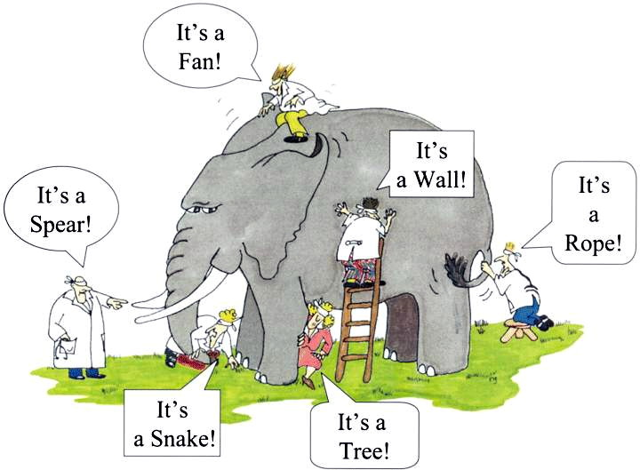

```{r setup, include=FALSE}
knitr::opts_chunk$set(echo = TRUE,
                      fig.width = 6,
                      fig.asp = 0.618,
                      out.width = "70%",
                      fig.align = "center",
                      fig.retina = 3)
set.seed(123)
```

<link rel="stylesheet" href="https://cdn.rawgit.com/jpswalsh/academicons/master/css/academicons.min.css"/>

Muitas vezes precisamos de técnicas que tolerem varíaveis independente contínuas. Não conseguimos usar ANOVA pois as variáveis independentes são discretas e representam grupos distintos de observações (uma variável independente -- Anova Unidireacional, duas variáveis independentes -- Anova Bidirecional, etc.). Muito menos teste $t$, pois segue o mesmo princípio da ANOVA mas se restringindo a apenas dois grupos, ou seja, apenas variável independente categórica binária. Para isso temos a técnica de Regressão Linear.

<aside>
Regressão Linear é a técnica preferida do autor 1
</aside>

**Regressão linear permite com que você coloque uma ou mais variáveis discretas ou contínuas como variáveis independentes e mensurar o poder de associação com a variável dependente, que deve ser contínua**^[variáveis dependentes binárias ou discretas serão apresentadas na [aula de Regressão Logística](7-Regressao_Logistica.html)].

## Interpretações

Para compreender regressão linear podemos usar de três interpretações distintas mas complementares:


* **Interpretação Geométrica**: Regressão como uma reta.
* **Interpretação Matemática**: Regressão como otimização.
* **Interpretação Estatística**: Regressão como poder de associação entre variáveis controlando para diversos outros efeitos.

Essas interpretações descrevem a mesma técnica mas sob aspectos diferentes. Lembra um pouco a metáfora dos sete sábios e o elefante (figura \@ref(fig:sete-sabios)):

> Numa pequena cidade viviam sete sábios cegos. Por conta de sua reconhecida sabedoria, as pessoas os procuravam em busca de conselhos para solução de seus problemas. Apesar de amigos, os sábios mantinham entre si uma competitividade acirrada, discutiam o tempo todo tentando provar quem era o mais sábio. Um dia trouxeram um elefante para a cidade. Os cegos rodearam o elefante para tocá-lo. Cada um pegou em uma parte distinta do animal e o descreve de acordo com aquela parte. Eles estão descrevendo o mesmo animal, mas cada um descrevendo apenas uma parte e pensando que é o todo. Eles estão, ao mesmo tempo, certos e errados^[regressão também é o motor que tem por de trás de quase todos os algoritmos e modelos de *machine learning*].

```{r sete-sabios, echo=FALSE, fig.cap='Os Sete Sábios e o Elefante. Figura de https://nsjour.wordpress.com/2012/10/21/seven-blind-men-and-the-elephant/', out.extra='class=external'}

```


### Interpretação Geométrica

Imagine que seus dados são pontos que vivem em um espaço multidimensional. **A regressão é uma técnica para encontrar a melhor reta^[tecnicamente um hiperplano que é subespaço de dimensão $n-1$ de um espaço de dimensão $n$**, por exemplo uma reta é um hiperplano 1-D de uma plano 2-D e um plano 2-D é um hiperplano de um plano 3-D e assim por diante] entre o conjunto de dados levando em conta todas as observações.

Isto é valido para qualquer espaço multidimensional, até para além de 3-D. Vamos mostrar um exemplo em 2-D que é a relação entre `x` e `y`^[acreditamos que visualizações 3-D de dados somente são aplicáveis em dois contextos: se você está usando mapas nas suas visualizações ou se você possui uma impressora 3D. Como não estamos fazendo nenhum dos dois, não vamos nos aventurar em imagens 3D (#ficaadica)], mas isto poder ser estendido para a relação `x1`, `x2`, ... e `y`.

```{r regressao-reta, echo=FALSE, warning=FALSE, message=FALSE, fig.cap='Uma relação entre x e y representado por uma reta de tendência'}
library(ggplot2)
library(dplyr)
library(patchwork)

# Generate synthetic data with a clear linear relationship
sim <- tibble(
  x = seq(from = 1, to = 300),
  y = rnorm(n = 300, mean = x + 2, sd = 25))

p1 <- sim %>% 
  ggplot(aes(x = x, y = y)) +
  geom_point(color = "steelblue")

p2 <- p1 +
  geom_smooth(method = "lm", se =  FALSE, color = "Red")

p1 + p2 + plot_layout(nrow = 1, widths = 1)
```

Vejam que regressão linear usando apenas uma variável dependente e uma variável independente é a mesma coisa que que correlação^[usando a técnica de Pearson].

### Interpretação Matemática

**A interpretação matemática é vista como uma otimização: encontrar a melhor reta entre os pontos que minimiza o erro quadrático médio (*mean squared error* -- MSE)**. Ao escolhermos a melhor reta, devemos escolher a melhor reta que minimiza as distâncias entre os pontos, sendo que podemos errar para mais ou para menos. E para evitarmos que os erros se cancelem, precisamos eliminar o sinal negativo de alguns erros e convertê-los para valores positivos. Para isso, pegamos todas os erros (diferenças entre o valor previsto pela reta e o valor verdadeiro) e elevamos ao quadrado (assim todo número negativo se tornará positivo e todo positivo se manterá positivo)^[tecnicamente podemos também pegar o valor absoluto de cada erro. Isto se chama erro absoluto médio (*mean absolute error* -- MAE). Mas não possui as mesmas propriedades analíticas que o MSE e é computacionalmente menos estável.]. Portanto, a **regressão se torna a busca do menor valor de uma função erro (MSE)** que possui uma formato de parábola (pois é uma função quadrática). Para os que tenham tido a oportunidade de estudar cálculo: estamos falando em achar o valor de `x` quando a derivada do MSE é zero ($\text{MSE}^{\prime} = 0$). 

```{r regressao-mse, echo=FALSE, warning=FALSE, message=FALSE, fig.cap='A melhor reta que minimiza a distância dos erros.'}
library(broom)

lm_sim <- augment(lm(y ~ x, data = sim))

p3 <- lm_sim %>% 
  ggplot(aes(x = x, y = y)) +
  geom_point(color = "steelblue") +
  geom_smooth(method = "lm", se =  FALSE, color = "Red")

p4 <- p3 +
  geom_segment(aes(xend = x, yend = .fitted))

p3 + p4 + plot_layout(nrow = 1, widths = 1)
```


### Interpretação Estatística

O efeito de X em Y mantendo Z fixo

## História da Regressão

The term "regression" was coined by Francis Galton in the nineteenth century to describe a biological phenomenon. The phenomenon was that the heights of descendants of tall ancestors tend to regress down towards a normal average (a phenomenon also known as regression toward the mean) [@galton1890kinship]. For Galton, regression had only this biological meaning [@galton1877typical], but his work was later extended by Udny Yule [@yule1897theory] and Karl Pearson [@pearson1903law] to a more general statistical context.

```{r fig-galton-pearson-yule, echo=FALSE, warning=FALSE, message=FALSE, fig.show='hold', out.width='20%', fig.align='default', fig.height=2, fig.asp=NULL, fig.cap='Da esquerda para direita: Francis Galton, Karl Pearson e Udny Yule -- Figuras de https://www.wikipedia.org', out.extra='class=external'}
library(cowplot)

pgalton <- ggdraw() + draw_image("images/galton.jpg")
ppearson <- ggdraw() + draw_image("images/pearson.jpg")
pyule <- ggdraw() + draw_image("images/yule.jpg")
pgalton + ppearson + pyule + plot_layout(nrow = 1, widths = 1)
```

## Pressupostos da Regressão Linear

By itself, a regression is simply a calculation using the data. In order to interpret the output of a regression as a meaningful statistical quantity that measures real-world relationships, researchers often rely on a number of classical assumptions. These often include:

1. The sample is representative of the population at large.
2. The independent variables are measured with no error.
3. Deviations from the model have an expected value of zero, conditional on covariates:  E(e_{i}|X_{i})=0
4. The variance of the residuals e_{i} is constant across observations (homoscedasticity).
5. The residuals e_{i} are uncorrelated with one another. Mathematically, the variance–covariance matrix of the errors is diagonal.

## Efeitos Principais e Efeitos de Interação

## Efeitos Não-Lineares

x^2

## Visualização

1. Coeficientes `{sjPlot}` [@sjPlot]
2. Diagnóstico `{ggfortify}` [@ggfortify]

## $R^2$ e $R^2$ ajustado


## Coeficientes Brutos versus Padronizados

## Conexões com o Teste $t$, ANOVA e Correlações

```{r meme-regressao-scooby, echo=FALSE}

```


Capítulo 5 de @poldrack2018 (Fitting models to data)

https://lindeloev.github.io/tests-as-linear/ @lindelov2019

Tudo acaba em pizza.

## Técnicas Avançadas de Regressão Linear

Nesta seção apenas apresentaremos alternativas, não é o foco desse conteúdo introdutório apresentar de maneira detalhada, mas sim de apontar o leitor na direção correta.

* **Regressão Robusta**
* **Regressão Regularizada**
* **Regressão Aditiva - Modelos Aditivos Generalizados**
* **Regressão Multinível**

### Regressão Robusta

Regressão linear não é uma boa alternativa na presença de observações extremas (também chamadas de *outliers*). O pressuposto de que os erros (ou resíduos) são distribuidos conforme uma distribuição Normal com média 0 faz com que as estimativas de uma regressão linear fiquem instáveis. Para exemplificar isso, vamos fazer uma simulação com 50 observações sendo que 40 observações são distribuídas como uma distribuição Normal e 10 observações são extremas (estão além de dois desvios padrões -- $\pm 2 \times \sigma$).

```{r simul-linear-reg, warning=FALSE, message=TRUE}
library(dplyr)

n_sims <- 50

sims <- tibble(
  x = 1:n_sims,
  y = c(rnorm(floor(4 * n_sims/5)), sample(c(-4:-3, 3:4),ceiling(n_sims/5), 1)),
  tipo = c(rep("normal", floor(4 * n_sims/5)), rep("extrema", ceiling(n_sims/5)))
) %>% 
  sample_frac(1L)  ## Randomize!
```

A figura \@ref(fig:plot-simul-linear-reg) mostra um diagrama de pontos (*dotplot*) da simulação e duas distribuições estimadas com os dados: Normal e $t$ de Student (graus de liberdade = 3). Devido às observações extremas, a distribuição Normal, para comportar todas as observações, se alarga e achata. Tal achatamento e alargamento não ocorrem na distribuição $t$ de Student. Isto se traduz em estimativas mais estáveis dos coeficientes da regressão na presença de observações extremas. Por esses motivos, para nós, a melhor a maneira de aplicar um modelo de regressão na presença de observações extremas é por meio de Estatística Bayesiana usando uma distribuição $t$ de Student como o "motor" de inferência.

<aside>
O primeiro autor possui um tutorial de [Estatística Bayesiana com R](https://storopoli.github.io/Estatistica-Bayesiana/) e uma das aulas é sobre [regressão robusta usando distribuição $t$ de Student](https://storopoli.github.io/Estatistica-Bayesiana/8-Regressao_Robusta.html).
</aside>

```{r plot-simul-linear-reg, warning=FALSE, message=FALSE, fig.cap='Simulação com Observações Normais e Extremas -- Distribuição Normal vs t de Student'}
library(ggplot2)
sims %>%
  ggplot(aes(y, fill = tipo)) +
  geom_dotplot(alpha = 0.5) +
  stat_function(fun = dnorm,
                args = list(mean = mean(sims$y), sd = sd(sims$y)),
                aes(color = "Distribuição\nNormal"), size = 3) +
  stat_function(fun = dt,
                args = list(df = 3),
                aes(color = "Distribuição t\nde Student"), size = 3) +
  scale_fill_brewer("Tipo de Observação", palette = "Set1",
                    guide = guide_legend(ncol = 1, nrow = 2, byrow = TRUE)) +
  scale_colour_brewer("Tipo de Distribuição", palette = "Set3",
                      guide = guide_legend(ncol = 1, nrow = 2, byrow = TRUE))+
  theme(legend.position = "bottom") +
  ylim(c(0, 0.4))
```

Caso o leitor não queria sair do paradigma NHST (afinal em Estatística Bayesiana não temos $H_0$ nem $p$-valores), há duas alternativas de [regressão robusta](https://en.wikipedia.org/wiki/Robust_regression):

1. **M-estimação**^[Termo inglês: *M-estimation*] [@huber1964]: robusta à observações extremas na variável dependentes, mas não nas independentes.
2. **Mínimos quadrados aparados**^[Termo inglês: *least trimmed squares* -- LTS] [@rousseeuw1984least]: robusto tanto à observações extremas na variável dependente quanto nas independentes. O método recomendado atualmente por diversas fontes [@ryan2008modern; @rousseeuw2006computing]

### Regressão Regularizada

Regularized regression is a type of regression where the coefficient estimates are constrained to zero. The magnitude (size) of coefficients, as well as the magnitude of the error term, are penalized. Complex models are discouraged, primarily to avoid overfitting.


“Regularization” is a way to give a penalty to certain models (usually overly complex ones). Ridge regression belongs to the set of L2 regularization tools. L2 regularization adds a penalty called an L2 penalty, which is the same as the square of the magnitude of coefficients. All coefficients are shrunk by the same factor, so all the coefficients remain in the model. The strength of the penalty term is controlled by a tuning parameter. When this tuning parameter (λ) is set to zero, ridge regression equals least squares regression. If λ = ∞, all coefficients are shrunk to zero. The ideal penalty is therefore somewhere in between 0 and ∞.
The other type of regularization, L1 regularization, limits the size of the coefficients by adding an L1 penalty equal to the absolute value of the magnitude of coefficients. This sometimes results in the elimination of some coefficients altogether, which can result in sparse models.

A regressão regularizada é um tipo de regressão em que as estimativas dos coeficientes são restritas a zero. A magnitude (tamanho) dos coeficientes, bem como a magnitude do termo de erro, são penalizados. Modelos complexos são desencorajados, principalmente para evitar *overfitting*.

#### Tipos de regressão regularizada

**Dois tipos comumente usados de métodos de regressão regularizados são regressão Ridge  e regressão de Lasso**.

A **regressão de Ridge[@tikhonov1943stability] é uma forma de criar um modelo parcimonioso quando o número de variáveis preditoras em um conjunto excede o número de observações ($m > p$) ou quando um conjunto de dados tem forte multicolinearidade (correlações entre variáveis preditoras)**. A regressão Ridge pertence ao conjunto de **ferramentas de regularização L2**. A regularização L2 adiciona uma penalidade chamada penalidade L2, que é igual ao quadrado da magnitude dos coeficientes. Todos os coeficientes são reduzidos pelo mesmo fator, de modo que todos os coeficientes permanecem no modelo. A força do termo de penalidade é controlada por um parâmetro de ajuste. Quando este parâmetro de ajuste ($\lambda$) é definido como zero, a regressão Ridge é igual à regressão linear. Se $\lambda = \infty$, todos os coeficientes são reduzidos a zero. A penalidade ideal é, portanto, algo entre $0$ e $\infty$.

A **regressão Lasso (*least absolute shrinkage and selection operator* -- Lasso) [@tibshirani1996regression; @efron2016computer] é um tipo de regressão linear que usa encolhimento (*shrinkage*)**. Encolhimento faz com os valores dos coeficientes sejam reduzidos em direção a um ponto central, como a média. Este tipo de redução é muito útil quando você tem altos níveis de muticolinearidade ou quando deseja automatizar certas partes da seleção de modelo, como seleção de variável / eliminação de parâmetro. Lasso usa a **regularização L1 que limita o tamanho dos coeficientes adicionando uma penalidade L1 igual ao valor absoluto**, ao invés do valor quadrado como L2, da magnitude dos coeficientes. Isso às vezes resulta na **eliminação de alguns coeficientes completamente**, o que pode resultar em modelos esparsos e seleção de variáveis.

Para usar modelos de regressão regularizada use a biblioteca `{glmnet}` [@glmnet].

### Regressão Aditiva - Modelos Aditivos Generalizados

Em estatística, um **modelo aditivo generalizado (*generalized additive model* -- GAM) é um modelo linear generalizado no qual a variável de resposta depende linearmente de funções suaves (chamadas de *splines*) desconhecidas de algumas variáveis preditoras, e o interesse se concentra na inferência sobre essas funções suaves**. Os GAMs foram desenvolvidos originalmente por Trevor Hastie e Robert Tibshirani [@hastie1986generalized]. Para usar GAMs no R use a biblioteca `{gam}` [@gam].

### Regressão Multinível

**Modelos multiníveis** (também conhecidos como modelos lineares hierárquicos, modelo linear de efeitos mistos, modelos mistos, modelos de dados aninhados, coeficiente aleatório, modelos de efeitos aleatórios, modelos de parâmetros aleatórios ou designs de gráfico dividido) são **modelos estatísticos de parâmetros que variam em mais de um nível** [@luke2019multilevel].

Modelos multiníveis são particularmente apropriados para projetos de pesquisa onde os **dados dos participantes são organizados em mais de um nível** (ou seja, dados aninhados). As unidades de análise geralmente são indivíduos (em um nível inferior) que estão aninhados em unidades contextuais / agregadas (em um nível superior).

**Modelos multiníveis geralmente se dividem em três abordagens**:

1.  *Random intercept model*: Modelo no qual cada grupo recebe uma constante (*intercept*) diferente
2.  *Random slope model*: Modelo no qual cada grupo recebe um coeficiente diferente para cada variável independente
3.  *Random intercept-slope model*: Modelo no qual cada grupo recebe tanto uma constante (*intercept*) quanto um coeficiente diferente para cada variável independente

<aside>
O primeiro autor possui um tutorial de [Estatística Bayesiana com R](https://storopoli.github.io/Estatistica-Bayesiana/) e uma das aulas é sobre [regressão multinível](https://storopoli.github.io/Estatistica-Bayesiana/9-Regressao_Multinivel.html).
</aside>

Para usar modelos multiníveis em R use a biblioteca `{lme4}` [@lme4].

## Ambiente

```{r SessionInfo}
sessionInfo()
```
