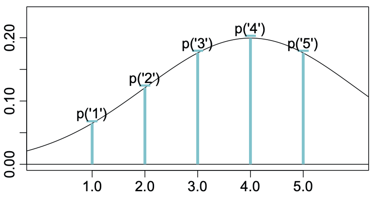
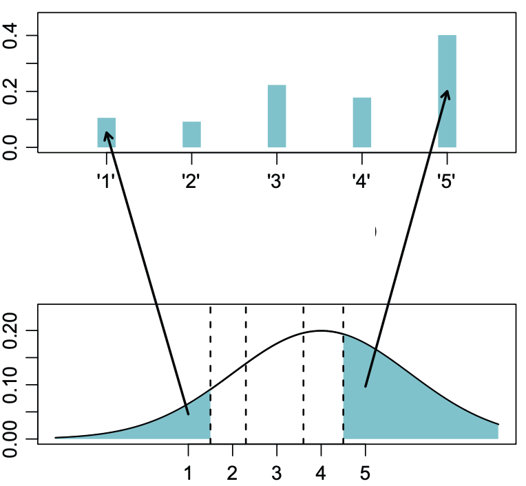

```{r setup, include=FALSE}
knitr::opts_chunk$set(echo = TRUE,
                      fig.width = 6,
                      fig.asp = 0.618,
                      out.width = "70%",
                      fig.align = "center",
                      fig.retina = 3)
library(ggplot2)
```

<link rel="stylesheet" href="https://cdn.rawgit.com/jpswalsh/academicons/master/css/academicons.min.css"/>

Os dados ordinais são frequentemente analisados como se fossem métricos. Porém, **a análise de dados ordinais como se fossem métricos pode sistematicamente levar a erros** como falsos positivos (ou seja, detectando um efeito onde não existe nenhum, erros Tipo I), falsos negativos (ou seja, perda de poder estatístico, erros Tipo II); e até mesmo uma inversão de efeitos (efeitos positivos podem virar efeitos negativos) [@liddellAnalyzingOrdinalData2018; @burknerOrdinalRegressionModels2019].

Primeiramente apresentaremos o que são dados ordinais e como eles diferem de dados métricos. Na sequência abordaremos a principal origem de dados ordinais em pesquisas (escala Likert). E por fim, mostraremos uma alternativa à regressão linear que é mais indicada para dados ordinais: regressão ordinal.

## Dados Ordinais

Dados ordinais são um tipo de dados categóricos e estatísticos em que as variáveis têm categorias naturais ordenadas e as distâncias entre as categorias não são conhecidas. A **principal diferença** entre os dados **métricos** e **categóricos** é justamente a questão da **distância**. Em dados métricos a distância entre 1 e 2 é a mesma entre 2 e 3. Porém, em dados categóricos tal distância não é assumida como igual ou conhecida. Portanto a distância entre uma categoria $X_1$ e uma categoria $X_2$ não é a mesma da distância entre a categoria $X_2$ e uma categoria $X_3$.

Para exemplificar a diferença entre dados métricos e ordinais, veja a figura \@ref(fig:metric) que mostra **dados ordinais em uma representação métrica de uma distribuição normal**. É possível ver que cada valor de 1 a 5 (items de uma escala Likert, por exemplo) é mapeado para um ponto específico da distribuição normal. Além disso, a distância entre tais mapeamentos é a mesma, ou seja, as mensurações são equidistantes.

```{r metric, echo=FALSE, fig.cap='Modelo Métrico. Figura adaptada de @liddellAnalyzingOrdinalData2018', out.extra='class=external'}

```

Já na figura \@ref(fig:latent) mostramos o **modelo latente ordinal.** Neste modelo os dados ordinais são representados de maneira discreta (gráfico de barras na parte superior) e não de maneira contínua como o modelo métrico. Além disso, os valores são mapeados para uma variável latente (não-observada) de uma distribuição normal que é contínua (histograma na parte inferior). Vejam que a direção da seta indica a causalidade dos dados. As opções discretas 1, 2, 3, 4 e 5 são originárias em uma variável latente contínua e se manifestam como opções discretas do respondente. Notem que no modelo latente ordinal as distâncias entre os mapeamentos na variável latente não são equidistantes.

```{r latent, echo=FALSE, fig.cap='Modelo Latente Ordenado. Figura adaptada de @liddellAnalyzingOrdinalData2018', out.extra='class=external'}

```

## Escala Likert

Nas ciências sociais temos um predomínio de escalas ordinais como maneiras de mensuração de opinião. Dentre as diversas maneiras de mensurar opiniões, a escala Likert é a escala mais utilizada por pesquisadores e cientistas. A escala Likert foi criada em 1932 por Rensis Likert (figura \@ref(fig:fig-likert)) na sua tese de doutorado como uma forma de identificar a extensão das atitudes e sentimentos de uma pessoa em relação à assuntos internacionais. Após isso, a escala Likert se tornou o principal instrumento quando usamos  perguntas para a qual a resposta é indicada em uma escala ordenada discreta que varia de um ponto final qualitativo a outro ponto final qualitativo (por exemplo, discordo totalmente para concordar totalmente).

```{r fig-likert, echo=FALSE, fig.cap='Rensis Likert. Figura de https://www.wikipedia.org', out.extra='class=external'}

```

As escalas Likert normalmente têm de 4 a 7 opções de resposta discretas. Um ponto importante é que **escalas likert ímpares permitem com que o respondente escolha uma opção neutra**, em outras palavras, o respondente pode escolhar ficar "em cima do muro". Abaixo um exemplo de uma escala Likert ímpar, de "Discordo Fortemente" até "Concordo Fortemente". Vejam que há a opção neutra (0) "Não Discordo nem Concordo".

```{r likert-impar, echo=FALSE}
library(gt)
tibble::tribble(
  ~"Discordo Fortemente", ~"Discordo", ~"Não Discordo nem Concordo", ~"Concordo", ~"Concordo Fortemente",
   -2L,                    -1L,          0L,                           1L,          2L
  ) %>%
  gt()
```

Já escalas Likert pares **não** permitem com que respondente escolha uma opção neutra. Elas **forçam o respondente a escolher uma polaridade positiva ou negativa**. Abaixo um exemplo de uma escala Likert par, de "Discordo Fortemente" até "Concordo Fortemente". Vejam que há a opção neutra (0) como na escala ímpar.

```{r likert-par, echo=FALSE}
tibble::tribble(
  ~"Discordo Fortemente", ~"Discordo", ~"Concordo", ~"Concordo Fortemente",
   -2L,                    -1L,          1L,          2L
  ) %>%
  gt()
```


## Como aplicar uma Regressão Ordinal no R

Para demonstrar dados ordinais, usaremos a biblioteca `{likert}` [@likert] que possui o *dataset* `pisaitems` que contém resultados do *Programme of International Student Assessment* (PISA) de 2009 para a América do Norte (Estados Unidos, Canadá e México). Vamos apenas utilizar as 11 questões do grupo de perguntas 24 sobre atitudes de alunos:

1. `ST24Q01` *I read only if I have to.* -- Eu leio apenas se for necessário.
2. `ST24Q02` *Reading is one of my favorite hobbies.* -- Ler é um dos meus passatempos favoritos.
3. `ST24Q03` *I like talking about books with other people.* -- Gosto de conversar sobre livros com outras pessoas.
4. `ST24Q04` *I find it hard to finish books.* -- Acho difícil terminar livros.
5. `ST24Q05` *I feel happy if I receive a book as a present.* -- Fico feliz se recebo um livro de presente.
6. `ST24Q06` *For me, reading is a waste of time.* -- Para mim, ler é perda de tempo.
7. `ST24Q07` *I enjoy going to a bookstore or a library.* -- Gosto de ir a uma livraria ou biblioteca.
8. `ST24Q08` *I read only to get information that I need.* -- Eu leio apenas para obter as informações de que preciso.
9. `ST24Q09` *I cannot sit still and read for more than a few minutes.* -- Não consigo ficar parado e ler por mais de alguns minutos.
10. `ST24Q10` *I like to express my opinions about books I have read.* -- Gosto de expressar minhas opiniões sobre os livros que li.
11. `ST24Q11` *I like to exchange books with my friends.* -- Gosto de trocar livros com meus amigos.

Nós, sempre que carregamos um *dataset* no R, temos o costume de usar a biblioteca `{skimr}` [@skimr] para produzir um sumário dos dados. Como vocês podem ver a escala usada para as perguntas 24 é uma Likert de 4 items: *Strongly disagree*, *Disagree*, *Agree*, *Strongly agree*.

```{r pisadata, warning=FALSE}
library(likert)
library(dplyr)
library(skimr)
data(pisaitems)
pisa <- pisaitems %>%
  dplyr::select(starts_with("ST24"))
skim(pisa)
```

A biblioteca `{likert}` ainda tem uma função bem conveniente para plotar gráficos de dados ordinais que usam escala Likert, veja um exemplo na figura \@ref(fig:plot-likert).

```{r plot-likert, fig.cap='Dados das 11 questões do PISA do grupo de perguntas 24 sobre atitudes de alunos'}
plot(likert(pisa))
```

### Primeiro Cenário -- Regressão Linear

Aqui vamos aplicar uma regressão linear para a variável `ST24Q02` que é a pergunta *Reading is one of my favorite hobbies.* (Ler é um dos meus passatempos favoritos). Como variável independente vamos usar o país do aluno `CNT` (Mexico, EUA ou Canadá). Aqui estamos convertendo a variável ordinal `ST24Q02` como numérica (contínua).

```{r lm}
linear_reg <- pisaitems %>%
  dplyr::select(CNT, ST24Q02) %>%
  mutate(ST24Q02 = as.numeric(ST24Q02)) %>%
  lm(ST24Q02 ~ CNT, data = .)

summary(linear_reg)
```

Como ilustrado no [tutorial sobre regressão linear](6-Regressao_Linear.html), o resultado pode ser interpretado pela coluna do $p$-valor (`Pr(>|t|)`) e pela coluna do coeficiente estimado (`Estimate`). Vemos que, na amostra de 2009, alunos do México concordam muito mais com a frase que "Ler é um dos meus passatempos favoritos" do que alunos do Canadá (categoria basal de comparação). E alunos dos Estados Unidos discordam muito mais que alunos do Canadá.

### Segundo Cenário -- Regressão Ordinal

Para o segundo cenário vamos usar os mesmos dados do primeiro só que agora estamos usando a função `polr()` da biblioteca `{MASS}` [@MASS] que aplica uma regressão ordinal. Vejam que aqui não precisamos converter a variável `ST24Q02` como numérica, pois `polr()` aceita (e prefere) uma variável ordinal como variável dependente. Além disso precisamos especificar a função de ligação que irá fazer a inferência da regressão com o argumento `method`. O padrão é a função logit (`"logistic"`) que é o inverso da função logística, mas no nosso caso especificamos a função de ligação probit (`"probit"`) que é o inverso da função de distribuição normal acumulada padrão, pois acreditamos que a variável latente por trás da `ST24Q02` segue uma distribuição normal. Uma última observação: o argumento `Hess` é necessário ser `TRUE` caso queira extrair um sumário da regressão com `summary()`.

```{r polr}
library(MASS)
ordinal_reg <- pisaitems %>%
  dplyr::select(CNT, ST24Q02) %>%
  polr(ST24Q02 ~ CNT, data = ., Hess = TRUE, method = "probit")
summary(ordinal_reg)
```

Como vocês podem ver o resultado da regressão ordinal é diferente. A regressão ordinal possui (no nosso caso) três constantes (*intercepts*) mapeando aonde na variável latente o limiar de cada valor ordinal foi mapeado. Além disso, o valor do coeficiente para México e Estados Unidos são maiores em termos absolutos, demonstrando uma melhor sensibilidade (poder estatístico) da regressão ordinal do que a regressão linear em dados ordinais.

## Cenários mais Complexos

Caso o leitor queira experimentar com modelos de regressão ordinais mais complexos sugerimos a biblioteca `{ordinal}` [@ordinal] que permite modelos ordinais complexos frequentistas e a biblioteca `{brms}` [@brms] que permite modelos ordinais complexos Bayesianos. Ambas bibliotecas possuem diversas funções de ligação e também é possível especificar modelos multiníveis (também chamados de modelos hierárquicos, modelos mistos, modelos de dois estágios etc.)

<aside>
O primeiro autor possui um tutorial de [Estatística Bayesiana com R](https://storopoli.github.io/Estatistica-Bayesiana/).
</aside>

## Comentários Finais

Dados ordinais, especialmente mensurados por escala Likert, aparecem com muita frequência em pesquisas. Tratar dados ordinais como se fossem métricos (contínuos) **não** é apropriado e portanto **regressão linear não é a técnica correta** quando a variável dependente é ordinal. Para isso recomendamos a **regressão ordinal**.


```{r SessionInfo}
sessionInfo()
```

