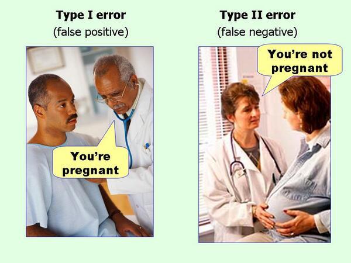

```{r setup, include=FALSE}
knitr::opts_chunk$set(echo = TRUE,
                      fig.align = "center",
                      fig.retina = 3)
```

<link rel="stylesheet" href="https://cdn.rawgit.com/jpswalsh/academicons/master/css/academicons.min.css"/>

Este tutorial apresenta os diferentes tipos de efeitos e seus tamanhos. Munido do tamanho do efeito, pesquisadores podem calcular o tamanho mínimo da amostra para que um teste estatístico possa detectar um efeito do tamanho desejado.

## Tamanho de Efeito

Tamanho de efeito é definido como "um número que mede a força da relação entre duas variáveis em uma população estatística ou uma estimativa baseada em amostra dessa quantidade. Pode referir-se ao valor de uma estatística calculada a partir de uma amostra, ao valor de um parâmetro de uma população estatística hipotética ou à equação que operacionaliza como as estatísticas ou parâmetros levam ao valor do tamanho do efeito" [@kelley2012effect]. Exemplos de tamanho de efeito incluem a correlação entre duas variáveis, o coeficiente de uma variável em uma regressão e a diferença média entre grupos distintos.

Os tamanhos de efeito **complementam o teste de hipótese estatística** e desempenham um **papel importante nas análises de poder de um teste estatístico e planejamento do tamanho da amostra**.

Os tamanhos de efeito podem ser medidos em **termos relativos ou absolutos**. Em tamanhos de efeito relativos, dois grupos são comparados diretamente um com o outro, como em razão de probabilidades (*odds ratio* -- OR) e riscos relativos. Para tamanhos de efeito absolutos, um valor absoluto maior sempre indica um efeito mais forte. Muitos tipos de medidas podem ser expressos como absolutos ou relativos e podem ser usados em conjunto porque transmitem informações diferentes. Se atentem ao contexto e quando usar medidas absolutas versus relativas^[autor 1 ficou indignado quanto um estudo falou que um grupo possuía 50% mais risco de acidente cardiovascular que outro grupo ao transformar o risco absoluto dos dois grupos, mensurados em 1.005 e 1.0075, em risco relativo. Aqui a diferença de risco absoluto é 0.25%, mas quando convertido para risco relativo se torna 50%!].

### Efeitos pequenos, médios e grandes

A principal referência em tamanhos de efeito é @cohen1988 que **distingue tamanhos de efeito em pequeno, médio e grande**; mas note que é necessário **cautela**: "Os termos 'pequeno', 'médio' e 'grande' são relativos, não apenas uns aos outros, mas à área da ciência do qual pertencem ou, ainda mais particularmente, ao conteúdo específico e ao método de pesquisa empregado em qualquer investigação..." [@cohen1988].

Os tamanho de efeito para as diferentes métricas estatística dos testes de hipótese são definidos em @cohen1988, mas mesmo assim eles podem variar conforme área da ciência e contexto, portanto o **pesquisador deve sempre justificar (preferencialmente com argumentos baseado em evidências) caso escolha usar as métricas padrões ou caso precise alterá-las**.

Neste tutorial cobriremos três principais tipos de efeito: $d$ de Cohen, $r$ de Pearson e $f^2$ de Cohen. Esses tipos de efeitos são os usados em testes $t$, ANOVA, correlação e regressão linear.

#### $d$ de Cohen

O $d$^[$d$ de diferença] de Cohen [@cohen1988] é a diferença entre a média de dois grupos padronizada por desvios padrões:

$$d = \frac{\mu_1 - \mu_2}{\sigma}$$

onde $\mu_1$ é a média de um grupo, $\mu_2$ média do outro grupo e $\sigma$ o desvio padrão com base em ambos os grupos.

**$d$ de Cohen é usado em testes de diferença de média como o teste $t$ e teste de Tukey**. Os tamanhos de efeito para $d$ de Cohen [@cohen1988] são:

- **Pequeno**: $d = 0.2$
- **Médio**: $d = 0.5$
- **Grande**: $d = 0.8$

Veja na figura \@ref(fig:cohen) uma demonstração dos tamanhos de efeito de $d$ de Cohen. Note que as medidas comparadas entre os grupos segue uma distribuição Normal (assim como o teste $t$ de Student -- paramétrico).

```{r cohen, echo=FALSE, warning=FALSE, message=FALSE, fig.cap='$d$ de Cohen', fig.height=10}
plot_cohen_d <- function(ES, show.legend = FALSE) {
  require(ggplot2)
  require(dplyr)
  # get mean2 depending on value of ES from d = (u1 - u2)/sd
  mean1 <- ES * 1 + 1
  df <- dplyr::tibble(
    x = seq(1 - 3 * 1, mean1 + 3 * 1, .01),
    y1 = dnorm(x, 1, 1),
    y2 = dnorm(x, mean1, 1),
    y.poly = pmin(y1, y2)
  )
  plot <- ggplot2::ggplot(data = df) +
    # add line for treatment group
    ggplot2::geom_line(aes(x = x, y = y1, color = "Grupo 2")) +
    # add line for control group
    ggplot2::geom_line(aes(x = x, y = y2, color = "Grupo 1")) +
    # shade overlap
    ggplot2::geom_polygon(aes(x = x, y = y.poly),
                          fill = "red", alpha = I(4 / 10),
                          show.legend = FALSE) +
    # add vlines for group means
    ggplot2::geom_vline(xintercept = 1, linetype = "dotted") +
    ggplot2::geom_vline(xintercept = mean1, linetype = "dotted") +
    # add plot title
    ggplot2::labs(title = paste0("Tamanho de Efeito (d de Cohen = ", ES, ")"),
                  x = NULL,
                  y = NULL) +
    # change colors and legend annotation
    ggplot2::scale_color_manual("Grupo",
                                values = c("Grupo 2" = "black", "Grupo 1" = "red"))
  if (show.legend == FALSE) {
    plot <- plot + theme(legend.position = "none")
    return(plot)
  }
  else{
    return(plot)
  }
}

library(purrr)
library(ggplot2)
library(patchwork)
list(0.2, 0.5, 0.8) %>%
  map(~ plot_cohen_d(.x)) %>%
  reduce(`+`) +
  plot_layout(nrow = 3, heights = 3)
```


#### $r$ de Pearson

Já cruzamos com o $r$ de Pearson[@pearson1895] no [tutorial de correlação](5-Correlacoes.html). Os tamanhos de efeito para $r$ de Pearson são [@cohen1988]:

- **Pequeno**: $r = 0.1$
- **Médio**: $r = 0.3$
- **Grande**: $r = 0.5$

Veja na figura \@ref(fig:pearson) uma demonstração dos tamanhos de efeito de $r$ de Pearson.

```{r pearson, echo=FALSE, warning=FALSE, message=FALSE, fig.cap='$r$ de Pearson'}
correlação <- c(0.1, 0.3, 0.5)

x <- 1:50
y <- rnorm(50, sd = 10)

complemento <- function(y, correlação, x) {
  y.perp <- residuals(lm(x ~ y))
  correlação * sd(y.perp) * y + y.perp * sd(y) * sqrt(1 - correlação^2)
}

X <- data.frame(z = as.vector(sapply(correlação,
                                     function(correlação) complemento(y, correlação, x))),
                correlação = ordered(rep(signif(correlação, 2),
                                         each = length(y))),
                y = rep(y, length(correlação)))
ggplot(X, aes(y, z, group = correlação)) +
  geom_rug(sides = "b") +
  geom_point(alpha = 0.5) +
  geom_smooth(method = "lm", color = "Red", se = FALSE) +
  facet_wrap(~ correlação, scales = "free", labeller = "label_both", ncol = 3) +
  theme(legend.position = "none")
```


#### $f^2$ de Cohen

O $f^2$ de Cohen é usado em contextos de testes estatísticos que usam a distribuição $F$ de Fisher. Em **ANOVAs e regressão linear, o $f^2$ é a proporção da variabilidade na variável dependente prevista pelas variável independentes e indica o poder preditivo de um modelo estatístico**. Em especial, para **regressões lineares, o $f^2$ pode ser usado como indicador de poder preditivo de um modelo completo $R^2$ ou como indicador de poder preditivo (e poder de influência) de uma variável independente sobre uma dependente (aqui o $f^2$ equivale ao coeficiente padronizado em desvios padrões)**.

Os tamanhos de efeito para $f^2$ de Cohen [@cohen1988] são:

- **ANOVA**:
  - **Pequeno**: $f^2 = 0.1$
  - **Médio**: $f^2 = 0.25$
  - **Grande**: $f^2 = 0.4$
- **Regressão Linear**:
  - **Pequeno**: $f^2 = 0.02$
  - **Médio**: $f^2 = 0.15$
  - **Grande**: $f^2 = 0.35$

## Tamanho de Amostra

O tamanho de amostra é influenciado diretamente pelo erro tipo I e erro tipo II. No [tutorial de $p$-valores](2-p-valores.html) definimos dois tipos erros:

* **Erro tipo I**, também chamado de **"falso positivo"**, é a chance de rejeitarmos a hipótese nula quando ela é verdadeira. Esse erro é o alpha $\alpha$ que é usado como limiar de significância do $p$-valor.
* **Erro tipo II**, também chamado de **"falso negativo"**, é a chance de não rejeitarmos a hipótese nula quando ela é falsa. Esse erro é identificado como a letra grega beta $\beta$. Além disso, o **poder** de um teste estatístico é mensurado como $1 - \beta$. O poder de um teste estatístico aumenta proporcionalmente ao tamanho amostral. Quanto maior a amostra, maior o poder do teste.

<aside>
Esses conceitos foram criados por matemáticos, então a nomenclatura erro tipo I e erro tipo II é perfeita matematicamente, pois no contexto de testes estatísticos contra uma hipótese nula só existem dois tipos de erros. Mas para o ensino da Estatística e comunicação de incertezas é péssima. Sempre que possível optamos por usar termos como "falso positivo" e "falso negativo" ao invés de erro tipo I e erro tipo II.
</aside>

```{r errors, echo=FALSE}

```

Esses dois tipos de erros foram cunhados por Jerzy Neyman, fundador do paradigma NHST^[*Null Hypothesis Significance Testing* -- NHST (tradução: teste de significância de hipótese nula)], que defendia a ideia de que é melhor absolver um culpado (erro tipo II -- falso negativo) do que culpar um inocente (erro tipo I -- falso positivo):

> "É mais sério condenar um homem inocente ou absolver um culpado? Isso dependerá das consequências do erro. A punição é morte ou multa? Qual é o risco de criminosos libertados para a sociedade ? Quais são os pontos de vista éticos atuais sobre punição? Do ponto de vista da teoria matemática, tudo o que podemos fazer é mostrar como o risco de erros pode ser controlado e minimizado. O uso dessas ferramentas estatísticas em qualquer caso específico para determinar como o equilíbrio deve ser alcançado , deve ser deixado para o investigador."^[do original em inglês: *"Is it more serious to convict an innocent man or to acquit a guilty? That will depend upon the consequences of the error. Is the punishment death or fine? What is the danger to the community of released criminals? What are the current ethical views on punishment? From the point of view of mathematical theory, all that we can do is to show how the risk of errors may be controlled and minimized. The use of these statistical tools in any given case in determining just how the balance should be struck, must be left to the investigator."*] [@neyman1933]

**Portanto, caro leitor, é você! Você deve pensar cuidadosamente em como o equilíbrio dessas taxas de erro deve ser atingido. Você não deve confiar em nenhum padrão porque cada situação exige que você considere quais seriam as taxas de erro ideais.**

Com isso esclarecido, desmonstraremos como calcular o tamanho de amostra no R.

## Calculando Tamanho de Amostra no R

Para calcular um tamanho de amostra no R usaremos a biblioteca `{pwr}` [@pwr]. As funções disponíveis são:

* `pwr.t.test()` -- **Teste $t$ para Amostras Independentes e para duas Amostras Pareadas**
* `pwr.r.test` -- **Correlação usando o $r$ de Pearson**
* `pwr.anova.test` -- **ANOVA Unidirecional**
* `pwr.f2.test` -- **Regressão Linear**

A lógica do `{pwr}` é a seguinte. Cada uma dessas função possui argumentos para:

1. **Tamanho de Efeito** -- `d`, `r` ou `f2`
2. **Tamanho de Amostra** -- `n`
3. **Probabilidade do erro tipo I -- falso positivo -- $\alpha$** -- `sig.level` padrão `0.05`
4. **Poder Estatístico -- 1 menos a probabilidade do erro tipo II -- falso negativo -- $1 - \beta$** -- `power`

Como esses quatro conceitos são interdependentes (para o cálculo de um é necessário saber o valor dos outros três), você deve especificar três dessas quatro métricas para obter o resultado da métrica desejada.

### Exemplo 1 - Teste $t$

Caso queira calcular o tamanho de amostra necessário para um teste $t$ detectar um efeito médio, $d = 0.5$, com taxa de falso positivo ($\alpha$) de 5%, e poder estatístico ($1 - \beta$) de 80%:

```{r pwr.t.test, warning=FALSE, message=FALSE}
library(pwr)

pwr.t.test(d = 0.5, sig.level = 0.05, power = 0.8)
```

São necessário dois grupos com `r ceiling(pwr.t.test(d = 0.5, sig.level = 0.05, power = 0.8)$n)` observações em cada grupo. Um total de amostra de `r 2 * ceiling(pwr.t.test(d = 0.5, sig.level = 0.05, power = 0.8)$n)` observações.

### Exemplo 2 - Regressão Linear

Vamos para um segundo exemplo com regressão linear. Aqui o uso da função `pwr.f2.test()` é um pouco mais complicado porque, além do tamanho de efeito `f2`, `sig.level`, `n` e `power`, temos que especificar os graus de liberdade do numerador `u` e graus de liberdade do denominador `v`.

Os graus de liberdade do numerador, `u`, é o número de coeficientes que você terá em seu modelo (menos a constante): $u = \text{coeficientes} - 1$. Os graus de liberdade do denominador, `v`, é o número de graus de liberdade do erro do modelo. Você pode calcular os graus de liberdade do denominador subtraindo o número de observações de amostra do número total de coeficientes exceto a constante menos 1. Então $v = n - u - 1$.

Suponha que você queira saber o tamanho de amostra necessário para uma regressão linear com cinco variáveis independentes detectar efeitos grandes, $f^2 = 0.35$, com taxa de falso positivo ($\alpha$) de 1%, e poder estatístico ($1 - \beta$) de 95%. Aqui temos `u = 5`, pois são seis coeficientes (contando com a constante) menos a constante ($6-1=5$).

```{r}
pwr.f2.test(f2 = 0.35, u = 5, sig.level = 0.01, power = 0.95)
```

Veja que o resultado não nos informa um tamanho amostral, mas sim os graus de liberdade do denominador: `v`. Lembre-se que $v = n - u - 1$, então $n = v + u + 1$. Portanto nosso tamanho amostral é 81. Isto quer dizer que para identificar efeitos grandes, de no mínimo $f^2 = 0.35$, tanto para $R^2$ quanto para influências das variáveis independentes (em coeficientes padronizados por desvios padrões), com $\alpha$ em 1% e poder estatístico de 95%, é necessário no mínimo uma amostra com 81 observações.

## Ambiente

```{r SessionInfo}
sessionInfo()
```
