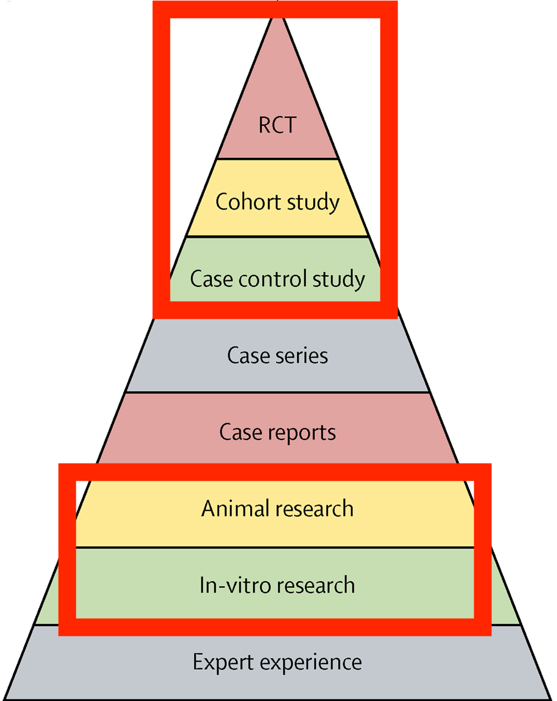
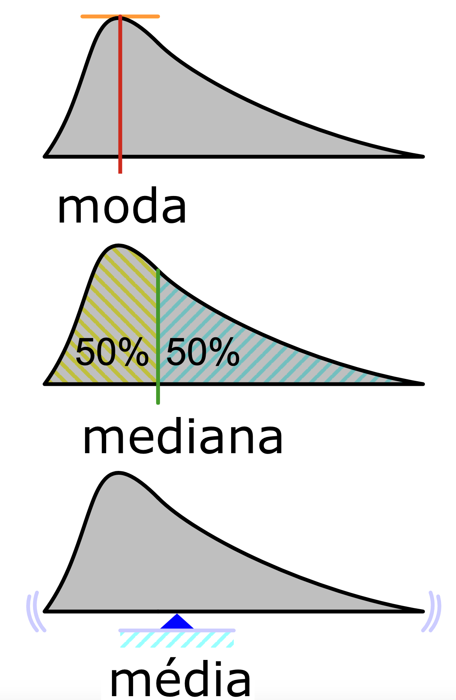
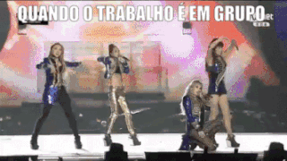

class: animated, fadeIn
layout: true

---
```{r setup, include=FALSE}
library(ggplot2)
library(magrittr)
library(DiagrammeR)
options(htmltools.dir.version = FALSE)
knitr::opts_chunk$set(fig.retina = 4,
                      warning = FALSE,
                      message = FALSE,
                      echo = FALSE)
set.seed(123)
```

```{r xaringan-themer, include=FALSE, warning=FALSE}
library(xaringanthemer)

extra_css <- list(
  ".tiny" = list("font-size" = "40%"),
  ".small" = list("font-size" = "70%"),
  ".large" = list("font-size" = "130%"),
  ".xlarge" = list("font-size" = "200%"),
  ".full-width" = list(
    display = "flex",
    width   = "100%",
    flex    = "1 1 auto"
  )
)

# UNINOVE Colors
style_mono_accent(
  base_color = "#29427A",
  header_font_google = google_font("Josefin Sans"),
  text_font_google   = google_font("Montserrat", "300", "300i"),
  code_font_google   = google_font("Fira Mono"),
  text_font_size     = "1.5em",
  footnote_font_size = "0.5em",
  extra_css = extra_css
)
```

```{r xaringan-logo, echo=FALSE}
# xaringanExtra tile view press key "O"
xaringanExtra::use_tile_view()

xaringanExtra::use_logo(
  image_url = "https://raw.githubusercontent.com/storopoli/UNINOVE-xaringan-theme/master/resources/uninove.png",
  link_url = "https://www.uninove.br",
  width = "110px",
  height = "55px")

xaringanExtra::use_fit_screen()
#xaringanExtra::use_animate_css()
xaringanExtra::use_tachyons()

# xaringanExtra webcam press key "W"
xaringanExtra::use_webcam()
```

# Por quê estou aqui?

.pull-left[
```{r starwars-trap, out.width = '100%'}
knitr::include_graphics("images/starwars-trap.gif")
```
]

--

.pull-right[
```{r lancet-evidences, out.width = '80%', fig.cap='Lancet, 2017'}

```
]


.footnote[Djulbegovic, B., & Guyatt, G. H. (2017). Progress in evidence-based medicine: a quarter century on. The Lancet, 390(10092), 415-423.]

---
# Calma! Somos profissionais...

--
.pull-left[
* Tentativas de **Homicídio**: 0

* Atentados à **Imagem** e **Honra**: 0

* **Mandatos de Segurança**: 0
]
--
.pull-right[
```{r borat-success.gif, out.width = '100%'}
knitr::include_graphics("images/borat-success.gif")
```
]

---
class: Large

# Princípios

--

* **"Dúvidas Idiotas"**
  * A única dúvida idiota é aquela que não é perguntada...
--

* **Acesso ao conteúdo e instrutor**
  * E-mails, WhatsApp e Conteúdo Aberto
--

* **_Peer Instruction_**
  * Seminários dos Alunos
--

* **_Opensource_**
  * `r icon::fontawesome$regular$frown` SPSS, Stata ou Excel
  * `r icon::fontawesome$regular$smile` JASP, Jamovi, R

---
# O que é estatística?

.pull-left[
## Descritiva
```{r graph-estatistica-descritiva, out.width='100%', fig.align='left'}
grViz("
 digraph estatistica_descritiva {
  graph [overlap = false,
         fontsize = 12,
         rankdir = LR]
  node [shape = oval,
        fontname = Helvetica]
  A [label = 'Dados\nObservados']
  node [shape = box,
        fontname = Helvetica]
  B [label = 'Média']; C [label = 'Mediana']; D [label = 'Moda']; E [label = 'Desvio\nPadrão']
  A -> {B C D E} [dir = forward,
                    tailport = 'e',
                    headport = 'w']
} 
")
```
]

.pull-right[
## Inferencial
```{r graph-estatistica-inferencial, out.width='100%', fig.align='right'}
grViz("
 digraph estatistica_inferencial {
  forcelabels = true;
  graph [overlap = false,
         fontsize = 12,
         rankdir = TD]
  node [shape = oval,
        fontname = Helvetica]
  A [label = 'Processo de\nGeração de Dados']
  B [label = 'Dados\nObservados']
  A -> B [dir = forward,
          xlabel = '  Probabilidade  ',
          tailport = 'e',
          headport = 'e']
  B -> A [dir = backward,
          label = '  Inferência  ',
          tailport = 'w',
          headport = 'w']
} 
")
```
]


---
class: top
# Machine Learning vs Estatística

```{r sample-data}
n <- 10
df <- tibble::tibble(x = 1:n,
                     y = (1:n) + rnorm(n, 0, 2))
base_plot <- df %>%
  ggplot(aes(x, y)) +
  geom_point(size = 5) +
  theme_void() +
  theme(
    axis.title.x = element_blank(),
    axis.text.x = element_blank(),
    axis.ticks.x = element_blank(),
    axis.title.y = element_blank(),
    axis.text.y = element_blank(),
    axis.ticks.y = element_blank()
  )
```

.pull-left[
## Estatística

```{r estatistica-plot}
base_plot + geom_smooth(size = 2, alpha = 0.5, method = "lm", se = F)
```
]

.pull-right[
## Machine Learning

```{r ml-plot}
base_plot + geom_smooth(size = 2, color = "red", span = 0.3, se = F)
```
]

---
# Distribuições Normais e não-Normais

.pull-left[
```{r dist-normal}
ggplot(data.frame(x = c(-4, 4)), aes(x, size = 3)) + 
  mapply(function(mean, sd, col) {
    stat_function(fun = dnorm, args = list(mean = mean, sd = sd), col = col)
  }, 
  # enter means, standard deviations and colors here
  mean = c(0, 1, .5), 
  sd = c(1, .5, 2), 
  col = c('red', 'blue', 'green')
) +
  theme_void() +
  theme(
    axis.title.x = element_blank(),
    axis.text.x = element_blank(),
    axis.ticks.x = element_blank(),
    axis.title.y = element_blank(),
    axis.text.y = element_blank(),
    axis.ticks.y = element_blank(),
    legend.position = "none"
  )
```
]

.pull-right[
```{r dist-not-normal}
ggplot(data.frame(x = c(-1, 6)), aes(x, size = 3)) + 
  mapply(function(meanlog, sdlog, col) {
    stat_function(fun = dlnorm, args = list(meanlog = meanlog, sdlog = sdlog), col = col)
  }, 
  # enter means, standard deviations and colors here
  meanlog = c(0, 1, 1.5), 
  sdlog = c(1, 1, 1), 
  col = c('red', 'blue', 'green')
) +
  theme_void() +
  theme(
    axis.title.x = element_blank(),
    axis.text.x = element_blank(),
    axis.ticks.x = element_blank(),
    axis.title.y = element_blank(),
    axis.text.y = element_blank(),
    axis.ticks.y = element_blank(),
    legend.position = "none"
  )
```
]

---
class: middle
# Medidas de Centralidade

.pull-left[
### Média
### Mediana
### Moda
]

.pull-right[
```{r media-moda-mediana, out.width='75%'}

```
]

---
# Medidas de Dispersão

## Desvio Padrão
.pull-left[
É importante porque, **em uma distribuição normal**, os intervalos contém um percentual da população

* $\mu \pm 1 \times \sigma \approx 68\%$
* $\mu \pm 2 \times \sigma \approx 95\%$
* $\mu \pm 3 \times \sigma \approx 99.7\%$
]

.pull-right[
```{r desvio-padrao, out.width='100%'}
knitr::include_graphics("images/desvio_padrao.png", dpi = 300)
```
]

---
class: xlarge
# Como fazer um seminário?

--
1. O que é o método/técnica?

--

2. Quando usar? O que está sendo "testado"?

--

3. Como interpretar os resultados?

--

4. Quais os pressupostos do método/técnica?

---
# Linguagem é importante

$$Y = \beta_0 + \beta_1 X_1 + \dots + \beta_n X_n + \epsilon $$

onde $\mathbf{E}(\epsilon | X) = 0$ e $\mathbf{V}(\epsilon | X) = \sigma^2$

--
.washed-blue.bg-blue.b--navy.ba.bw2.br3.shadow-5.ph4.mt5[
Regressão Linear é uma técnica para estimar coeficientes de associação $\beta$ entre um conjunto de variáveis independentes $X$ e uma variável dependente $Y$ e os erro $\epsilon$ do modelo pressupõem-se que possui média $\mu$ 0 e desvio padrão qualquer $\sigma^2$
]

---
### O que são modelos e por quê precisamos deles?

```{r graph-model, out.width='100%', fig.align='top'}
grViz("
 digraph model {
  forcelabels = true;
  graph [overlap = false,
         fontsize = 12]
  node [shape = oval,
        fontname = Helvetica]
  A [label = 'Densidade\nDemográfica']
  AB[label = '', fixedsize = 'false', width=0, height=0, shape=none]
  B [label = 'Trânsito\n(km)']
  C [label = 'mm de\nChuva']
  A -> AB [arrowhead = None, label = '+']
  AB -> B 
  C -> AB [xlabel = '  +']
 {rank=same; A; AB; B}
} 
")
```

.footnote[**Uma boa referência**: Smaldino, P. E. (2017). Models Are Stupid, and We Need More of Them. In Computational Social Psychology (Issue March, pp. 311–331). Routledge. https://doi.org/10.4324/9781315173726-14]

---
# Vamos formar os grupos?

.pull-left[
```{r trabalho-em-grupo}

```
]

.pull-right[
Acesse [http://bit.ly/s2estatistica](http://bit.ly/s2estatistica)

* Email
* Nome
* RA
* Linha de Pesquisa
]

.footnote[Se você cair em um grupo que não goste, culpe o script R e a seed do gerador de números aleatórios. Coisas ruins acontecem, você pode escolher se isso vai ser uma oportunidade de crescimento ou não...]
