class: animated, fadeIn
layout: true

---
class: inverse, middle, Center
```{r setup, include=FALSE}
library(ggplot2)
library(magrittr)
library(DiagrammeR)
library(countdown)
options(htmltools.dir.version = FALSE,
        htmltools.preserve.raw = FALSE)
knitr::opts_chunk$set(fig.retina = 4,
                      warning = FALSE,
                      message = FALSE,
                      echo = FALSE)
set.seed(123)
```

```{r xaringan-themer, include=FALSE, warning=FALSE}
library(xaringanthemer)

extra_css <- list(
  ".tiny" = list("font-size" = "40%"),
  ".small" = list("font-size" = "70%"),
  ".large" = list("font-size" = "130%"),
  ".xlarge" = list("font-size" = "200%"),
  ".full-width" = list(
    display = "flex",
    width   = "100%",
    flex    = "1 1 auto"
  ),
  "white" = list("color" = "white !important")
)

# UNINOVE Colors
style_mono_accent(
  base_color = "#29427A",
  header_font_google = google_font("Josefin Sans"),
  text_font_google   = google_font("Montserrat", "300", "300i"),
  code_font_google   = google_font("Fira Mono"),
  text_font_size     = "1.5em",
  footnote_font_size = "0.4em",
  extra_css = extra_css
)
```

```{r xaringan-logo, echo=FALSE}
# xaringanExtra tile view press key "O"
xaringanExtra::use_tile_view()

xaringanExtra::use_logo(
  image_url = "https://raw.githubusercontent.com/storopoli/UNINOVE-xaringan-theme/master/resources/uninove.png",
  link_url = "https://www.uninove.br",
  width = "110px",
  height = "55px")

xaringanExtra::use_fit_screen()
#xaringanExtra::use_animate_css()
xaringanExtra::use_tachyons()

# xaringanExtra webcam press key "W"
xaringanExtra::use_webcam()

# xaringanExtra Broadcast inside presenter notes key "P"
xaringanExtra::use_broadcast()

# xaringanExtra Search press Control + F or click the 🔍 icon.
xaringanExtra::use_search(show_icon = TRUE)
```

# Por quê estou aqui?

```{r starwars-trap, out.width = '100%'}
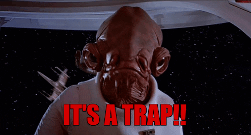
```

---
# Calma! Somos profissionais...

--
.pull-left[
* Tentativas de **Homicídio**: 0

* Atentados à **Imagem** e **Honra**: 0

* **Mandatos de Segurança**: 0
]
--
.pull-right[
```{r borat-success.gif, out.width = '100%'}
knitr::include_graphics("images/borat-success.gif")
```
]

---
class: Large

# Princípios

--

* **"Dúvidas Idiotas"**
  * A única dúvida idiota é aquela que não é perguntada...
--

* **Acesso ao conteúdo e instrutor**
  * E-mails, WhatsApp e Conteúdo Aberto
--

* **_Peer Instruction_**
  * Seminários dos Alunos
--

* **_Opensource_**
  * `r icons::icon_style(icons::fontawesome("frown"), scale = 2)` SPSS, Stata ou Excel `r icons::icon_style(icons::fontawesome("creative-commons-nc"), scale = 2)`
  * `r icons::icon_style(icons::fontawesome("smile"), scale = 2)` JASP, Jamovi, R `r icons::icon_style(icons::fontawesome("rocket"), scale = 2)`

---
# Open Science

.pull-left[
```{r osf_example.png, out.width = '85%'}
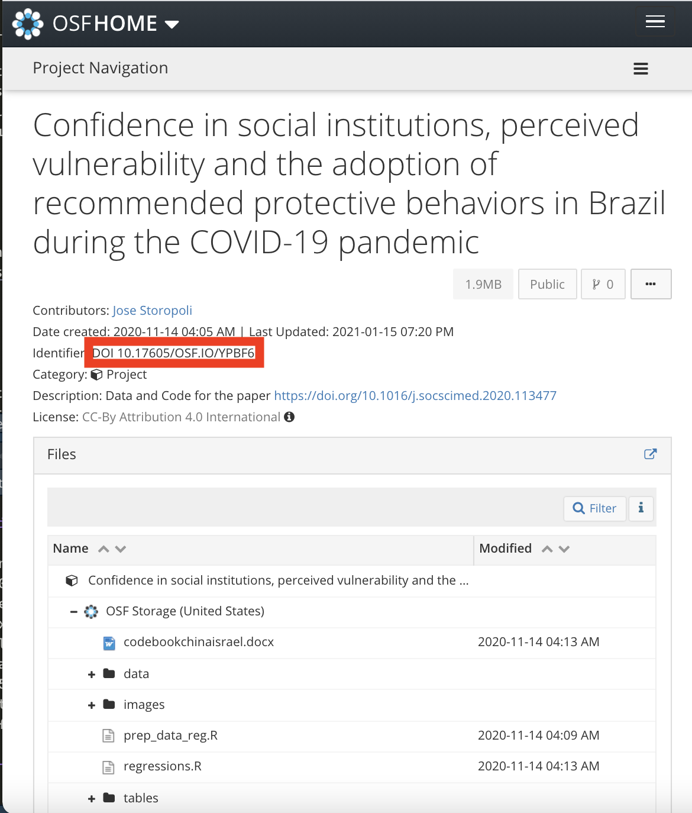
```
]

.pull-right[
```{r osf_logo.jpeg, out.width = '100%'}
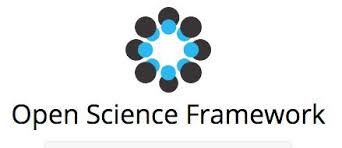
```
]

.footnote[[Repositório de dados da OSF](https://osf.io/ypbf6/) do artigo: Storopoli, J., da Silva Neto, W. L. B., & Mesch, G. S. (2020). Confidence in social institutions, perceived vulnerability and the adoption of recommended protective behaviors in Brazil during the COVID-19 pandemic. Social Science & Medicine, 265, 113477.]

---
class: inverse, middle, center
# Como a ciência avança?

```{r science, out.width='80%'}
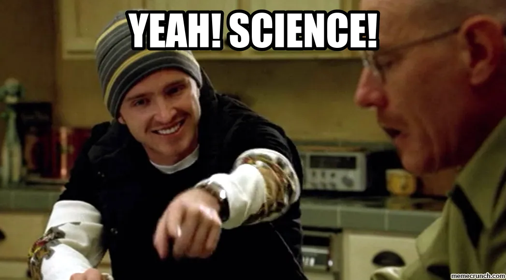
```

---

# Como a Ciência Avança?

**Método Científico Hipótetico Dedutivo**

```{r graph-hipotetico-dedutivo, out.width='100%'}
grViz("
 digraph hipotetico_dedutivo {
  forcelabels = true;
  graph [overlap = false,
         fontsize = 12,
         rankdir = TD]
  node [shape = oval,
        fontname = Helvetica]
  A [label = 'Teoria']
  B [label = 'Realidade']
  A -> B [dir = forward,
          xlabel = 'Hipóteses ',
          tailport = 'e',
          headport = 'e']
  B -> A [dir = backward,
          xlabel = 'Predições ',
          tailport = 'w',
          headport = 'w']
}
")
```

.footnote[[Wikipedia - Método hipotético-dedutivo](https://pt.wikipedia.org/wiki/Método_hipotético-dedutivo).]

---
class: center, middle
# Método Científico

<video width="600" height="400" controls>
  <source src="images/feynman.mp4" type="video/mp4">
</video>

.footnote[[Richard Feynman](https://en.wikipedia.org/wiki/Richard_Feynman) - Universidade de Cornell, 9 de Novembro de 1964]

---
# Teoria vs Realidade

.washed-blue.bg-blue.b--navy.ba.bw2.br3.shadow-5.ph4.mt5[
Se sua teoria discordar da realidade, sua teoria está errada. Não importa o quão bela ela é, o quão inteligente você é, quem você é. Se ela discorda da realidade ela está errada!
]

.footnote[[Richard Feynman](https://en.wikipedia.org/wiki/Richard_Feynman) - Universidade de Cornell, 9 de Novembro de 1964]

---
# Teoria vs Realidade

.pull-left[
Objetos pesados caem mais rápido que objetos leves.

```{r aristotle, out.width='60%'}
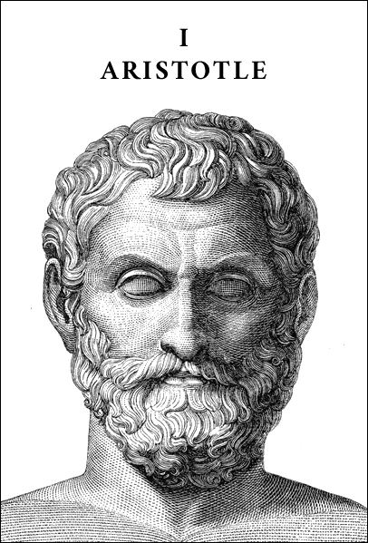
```
]

--
.pull-right[
```{r galileo_pisa, out.width='70%'}
knitr::include_graphics("images/galileo_pisa.jpg")
```
]

---
# Teoria vs Realidade

.pull-left[
A gravidade afeta não só a materia mas também a luz.

```{r einstein, out.width='50%'}
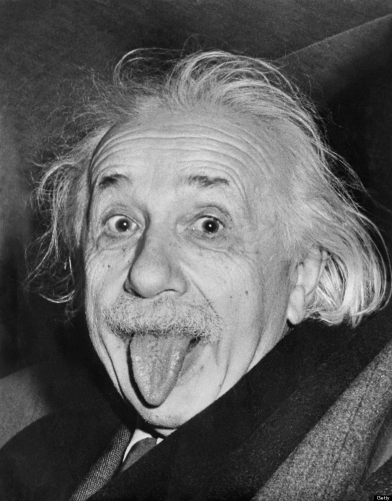
```
]

--
.pull-right[
```{r einstein_eclipse}
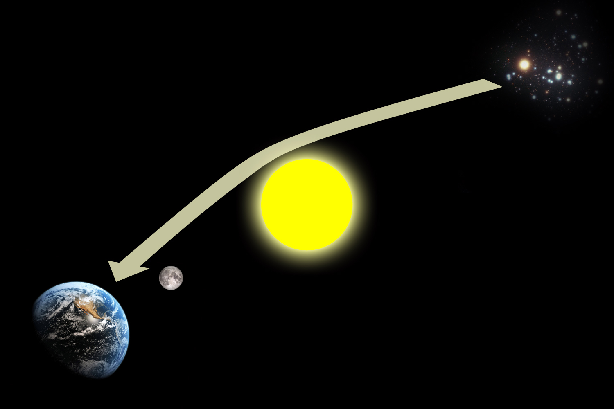
```
]

.footnote[
[Eclipse Solar de 29 de Maio de 1919](https://en.wikipedia.org/wiki/Solar_eclipse_of_May_29,_1919)
]

???
A previsão de Albert Einstein da curvatura da luz pela gravidade do Sol, um dos componentes de sua teoria geral da relatividade, pode ser testada durante um eclipse solar, quando estrelas com posição aparente perto do sol se tornam visíveis.

---
# Como que a Ciência Avança?

.pull-left[
### Hierarquia de Evidências

* RCT - Ensaio Clínico Randomizado
* Estudo de Coorte
* Estudo de Caso-controle
]

.pull-right[
```{r lancet-evidences, out.width = '80%', fig.cap='Lancet, 2017'}
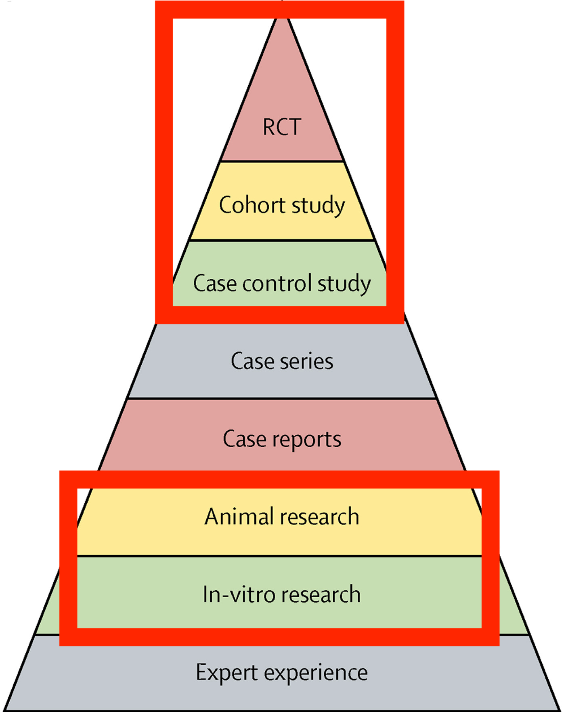
```
]

.footnote[Djulbegovic, B., & Guyatt, G. H. (2017). Progress in evidence-based medicine: a quarter century on. The Lancet, 390(10092), 415-423.]

???
Os **estudos de coorte** são um tipo
específico de desenho de estudo observacional que apresenta um nível de
evidência maior que os outros observacionais, mas menor nível de evidência que
os estudos experimentais. Compara a experiência de um grupo exposto e outro não
exposto ao longo do tempo, para a identificação dos efeitos da exposição na
incidência do evento de interesse.

---
class: inverse, middle

# Estatística

```{r statistics_intro, out.width='80%'}
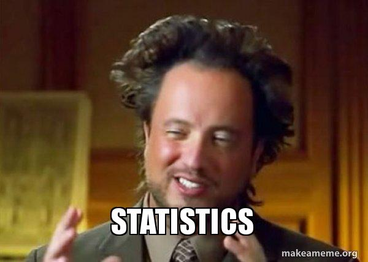
```

---
# O que é estatística?

--
.pull-left[
**Descritiva**
```{r graph-estatistica-descritiva, out.width='100%', fig.align='left'}
grViz("
 digraph estatistica_descritiva {
  graph [overlap = false,
         fontsize = 12,
         rankdir = LR]
  node [shape = oval,
        fontname = Helvetica]
  A [label = 'Dados\nObservados']
  node [shape = box,
        fontname = Helvetica]
  B [label = 'Média']; C [label = 'Mediana']; D [label = 'Moda']; E [label = 'Desvio\nPadrão']
  A -> {B C D E} [dir = forward,
                    tailport = 'e',
                    headport = 'w']
}
")
```
]

--
.pull-right[
**Inferencial**
```{r graph-estatistica-inferencial, out.width='100%', fig.align='right'}
grViz("
 digraph estatistica_inferencial {
  forcelabels = true;
  graph [overlap = false,
         fontsize = 12,
         rankdir = TD]
  node [shape = oval,
        fontname = Helvetica]
  A [label = 'Processo de\nGeração de Dados']
  B [label = 'Dados\nObservados']
  A -> B [dir = forward,
          xlabel = '  Probabilidade  ',
          tailport = 'e',
          headport = 'e']
  B -> A [dir = backward,
          label = '  Inferência  ',
          tailport = 'w',
          headport = 'w']
}
")
```
]


---
class: top
# Machine Learning vs Estatística

```{r sample-data}
n <- 10
df <- tibble::tibble(x = 1:n,
                     y = (1:n) + rnorm(n, 0, 2))
base_plot <- df %>%
  ggplot(aes(x, y)) +
  geom_point(size = 5) +
  theme_void() +
  theme(
    axis.title.x = element_blank(),
    axis.text.x = element_blank(),
    axis.ticks.x = element_blank(),
    axis.title.y = element_blank(),
    axis.text.y = element_blank(),
    axis.ticks.y = element_blank()
  )
```

--
.pull-left[
**Estatística**

```{r estatistica-plot}
base_plot + geom_smooth(size = 2, alpha = 0.5, method = "lm", se = FALSE)
```
]

--
.pull-right[
**Machine Learning**

```{r ml-plot}
base_plot + geom_smooth(size = 2, color = "red", span = 0.3, se = FALSE)
```
]

---
# Distribuições Normais e não-Normais

--
.pull-left[
```{r dist-normal}
ggplot(data.frame(x = c(-4, 4)), aes(x, size = 3)) +
  mapply(function(mean, sd, col) {
    stat_function(fun = dnorm, args = list(mean = mean, sd = sd), col = col)
  },
  # enter means, standard deviations and colors here
  mean = c(0, 1, .5),
  sd = c(1, .5, 2),
  col = c("red", "blue", "green")
) +
  theme_bw() +
  theme(
    axis.title.x = element_blank(),
    #axis.text.x = element_blank(),
    #axis.ticks.x = element_blank(),
    axis.title.y = element_blank(),
    #axis.text.y = element_blank(),
    #axis.ticks.y = element_blank(),
    legend.position = "none"
  )
```
]
--
.pull-right[
```{r dist-not-normal}
ggplot(data.frame(x = c(-1, 6)), aes(x, size = 3)) +
  mapply(function(meanlog, sdlog, col) {
    stat_function(fun = dlnorm, args = list(meanlog = meanlog, sdlog = sdlog), col = col)
  },
  # enter means, standard deviations and colors here
  meanlog = c(0, 1, 1.5),
  sdlog = c(1, 1, 1),
  col = c("red", "blue", "green")
) +
  theme_bw() +
  theme(
    axis.title.x = element_blank(),
    #axis.text.x = element_blank(),
    #axis.ticks.x = element_blank(),
    axis.title.y = element_blank(),
    #axis.text.y = element_blank(),
    #axis.ticks.y = element_blank(),
    legend.position = "none"
  )
```
]

---
# Pressupostos vs Realidade

```{r assumptions-vs-reality, out.width='100%'}
knitr::include_graphics("images/assumptions-vs-reality.jpeg")
```

.footnote[Figura de [Katherine Hoffman](https://www.khstats.com/blog/tmle/tutorial/). Reprodução Autorizada.]

???
**Katherine Hoffman**: Biostatistician at Weill Cornell Medicine in New York City

---
class: inverse, middle, center

# Estatística Descritiva

`r icons::icon_style(icons::fontawesome("chart-pie"), scale = 5)`

---
# Estatística Descritiva

.washed-blue.bg-blue.b--navy.ba.bw2.br3.shadow-5.ph4.mt5[
"Sumariza e quantifica as características de uma amostra de dados observados".
]

--

## Geralmente divide-se em:

* **Medidas de Centralidade**: média, mediana, moda ...

* **Medidas de Dispersão**: desvio padrão, variância, correlação, percentis, quartis ...

---
class: middle
# Medidas de Centralidade

.pull-left[
### Média
### Mediana
### Moda
]

.pull-right[
```{r media-moda-mediana, out.width='75%'}
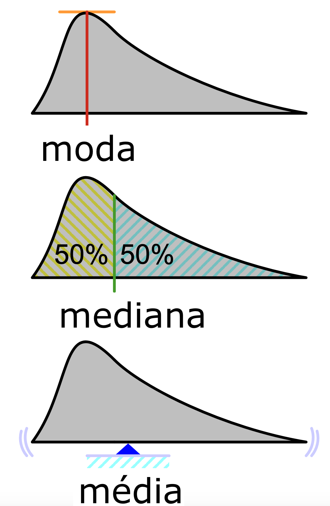
```
]

---
# Média vs Mediana

.washed-blue.bg-blue.b--navy.ba.bw2.br3.shadow-5.ph4.mt5[
O que acontece quando o <u>Bill Gates</u> entra em um restaurante?
]

--
.washed-blue.bg-red.b--dark-red.ba.bw2.br3.shadow-5.ph4.mt5[
A <u>média salarial</u> dos consumidores do restaurante sobe 50 mil dólares!
]

---
# Medidas de Dispersão

## Desvio Padrão
.pull-left[
É importante porque, **em uma distribuição normal**, os intervalos contém um percentual da população

* $\mu \pm 1 \times \sigma \approx 68\%$
* $\mu \pm 2 \times \sigma \approx 95\%$
* $\mu \pm 3 \times \sigma \approx 99.7\%$
]

.pull-right[
```{r desvio-padrao, out.width='100%'}
knitr::include_graphics("images/desvio_padrao.png", dpi = 300)
```
]

---
# Medidas de Dispersão - Percentil e IQR

```{r percentil-IQR, out.width='50%', fig.align='center'}
knitr::include_graphics("images/percentil-IQR.png", dpi = 300)
```

---
class: inverse, middle, center

# Estatística Inferencial

`r icons::icon_style(icons::fontawesome("chart-line"), scale = 5)`

---
# Estatística Inferencial

"Conjunto de técnicas e procedimentos para testar hipóteses sobre uma amostra generalizando para uma população-alvo"

## Mistureba de coisas

--

* **Testes Estatísticos** - Pearson & Student

--

* $p$-**valor** - Fisher

--

* **Hipótese Nula** (inclusive o tal dos 5%) - Neyman

--

* **Intervalos de Confiança** - Neyman

.footnote[Além disso eles brigavam entre si...]

---
class: inverse, center, middle
```{r statisticians}
library(cowplot)
p1 <- ggdraw() + draw_image("images/pearson.jpg") +
  draw_label("Karl Pearson", color = "black", hjust = 1.2, vjust = 8, size = 16)
p2 <- ggdraw() + draw_image("images/gosset.jpg") +
  draw_label("William  Gosset\n(Student)", color = "orange", hjust = 0.8, vjust = 4, size = 16)
p3 <- ggdraw() + draw_image("images/fisher.jpg") +
  draw_label("Ronald Fisher", color = "white", hjust = 0.9, vjust = 10, size = 16)
p4 <- ggdraw() + draw_image("images/neyman.jpeg") +
  draw_label("Jerzy Newman", color = "white", hjust = 1.2, vjust = -1, size = 16)

plot_grid(p1, p2, p3, p4,
          ncol = 2,
          label_colour = "red4") +
  theme(plot.background = element_rect(fill = "#29427A", color = "#29427A"), )
```


.footnote[Figuras da [.white[Wikipedia]](https://www.wikipedia.org/).]

---

# Teste de Hipóteses

.washed-blue.bg-blue.b--navy.ba.bw2.br3.shadow-5.ph4.mt5[
Forma de <u>inferência estatística</u> que usa dados de uma <u>amostra</u> para tirar conclusões sobre um <u>parâmetro populacional</u> ou uma <u>distribuição de probabilidade populacional</u>.
]

--

.washed-blue.bg-red.b--dark-red.ba.bw2.br3.shadow-5.ph4.mt5[
.small[Exemplo: Uma amostra de 40 pessoas separadas de maneira aleatória em dois grupos na qual testamos qual a <u>diferença</u> entre o tempo de internação na UTI (<u>parâmetro populacional</u>) para quem toma cloroquina (tratamento) ou comprimido de farinha (placebo).
]
]

---
# Hipótese Nula - $H_0$

.washed-blue.bg-blue.b--navy.ba.bw2.br3.shadow-5.ph4.mt5[
Uma hipótese padrão de que uma quantidade a ser medida é **zero** (nula). Normalmente, a quantidade a ser medida é a **diferença entre duas situações**, ou que um **efeito é inexistente** (nulo).
]

---
# Quando é que as coisas dão errado?

--
* **Amostra não representa a população**

--
  * Ex: Pesquisa de Intenção de Voto apenas na Avenida Paulista ao meio-dia.

--
* **Os dados não são independentes**

--
  * Ex: Dois sujeitos conhecidos são abordados ao mesmo tempo numa pesquisa de intenção de voto.

--
  * **Principais fontes de dependência?**
    * Temporal
    * Espacial
    * E qualquer outra `r emo::ji("person_shrugging")`

---
class: inverse, middle, center
# $p$-valor

`r icons::icon_style(icons::fontawesome("exclamation-triangle"), scale = 5)`

## $p$-valores são de difícil entendimento, $p<0.05$.

---
# O que é o $p$-valor?

* $p$-valor é a probabilidade dos dados que você obteve condicionado que a hipótese nula é verdadeira.

--

* No mundo paralelo da Hipótese Nula, $p$-valor é a probabilidade de você obter dados como os quais da sua amostra.

--

* Para os que gostam do formalismo matemático: $$p = P(D|H_0).$$

---
# O que *não* é o $p$-valor?

--

* $p$-valor **não** é a probabilidade da Hipótese nula: $P(D|H_0) \neq P(H_0|D)$. Exemplo: $$P(\text{tosse} | \text{COVID}) \neq P(\text{COVID} | \text{tosse}).$$

--

* $p$-valor **não** é a probabilidade dos dados serem produzidos pelo acaso.

--

* $p$-valor **não** mensura o tamanho do efeito de um teste estatístico.

---

# Tamanho do Efeito

```{r effectsize}
plot_effectsize <- function(ES, show.legend = FALSE) {
  require(ggplot2)
  require(dplyr)
  # get mean2 depending on value of ES from d = (u1 - u2)/sd
  mean1 <- ES * 1 + 1
  df <- dplyr::tibble(
    x = seq(1 - 3 * 1, mean1 + 3 * 1, .01),
    y1 = dnorm(x, 1, 1),
    y2 = dnorm(x, mean1, 1),
    y.poly = pmin(y1, y2)
  )
  plot <- ggplot2::ggplot(data = df) +
    # add line for treatment group
    ggplot2::geom_line(aes(x = x, y = y1, color = "Grupo 2")) +
    # add line for control group
    ggplot2::geom_line(aes(x = x, y = y2, color = "Grupo 1")) +
    # shade overlap
    ggplot2::geom_polygon(aes(x = x, y = y.poly),
                          fill = "red", alpha = I(4 / 10),
                          show.legend = FALSE) +
    # add vlines for group means
    ggplot2::geom_vline(xintercept = 1, linetype = "dotted") +
    ggplot2::geom_vline(xintercept = mean1, linetype = "dotted") +
    # add plot title
    ggplot2::labs(title = paste0("Tamanho de Efeito ", ES),
                  x = NULL,
                  y = NULL) +
    # change colors and legend annotation
    ggplot2::scale_color_manual("Grupo",
                                values = c("Grupo 2" = "black", "Grupo 1" = "red")) +
    theme_bw()
  if (show.legend == FALSE) {
    plot <- plot + theme(legend.position = "none")
    return(plot)
  }
  else{
    return(plot)
  }
}
```

.pull-left[
Todos esses resultados atingem $p$-valores menores que 5% se conseguirmos uma amostra grande o suficiente
]

.pull-right[
```{r plot_effectsize}
library(purrr)
library(patchwork)
list(0.2, 0.5, 0.8) %>%
  map(~ plot_effectsize(.x)) %>%
  reduce(`+`) +
  plot_layout(nrow = 3, heights = 3)
```

]


---
class: Large
# Como fazer um seminário?

--

1. O que é o **método/técnica**?

--

2. **Quando** usar? O que está sendo **"testado"**?
  * Hipótese nula $H_0$?

--

3. Como **interpretar os resultados**?

--

4. Quais os **pressupostos** do método/técnica?

--

5. **Parte Prática**
  * Como aplicar o método no JASP
  * Dados reais

---
# Linguagem é importante

$$Y = \beta_0 + \beta_1 X_1 + \dots + \beta_n X_n + \epsilon $$

onde $\mathbf{E}(\epsilon | X) = 0$ e $\mathbf{V}(\epsilon | X) = \sigma^2$

--
.washed-blue.bg-blue.b--navy.ba.bw2.br3.shadow-5.ph4.mt5[
Regressão Linear é uma técnica para estimar coeficientes de associação $\beta$ entre um conjunto de variáveis independentes $X$ e uma variável dependente $Y$ e os erros $\epsilon$ do modelo pressupõem-se que possui média $\mu$ 0 e desvio padrão qualquer $\sigma^2$
]

---
### O que são modelos e por quê precisamos deles?

```{r graph-model, out.width='100%', fig.align='top'}
grViz("
 digraph model {
  forcelabels = true;
  graph [overlap = false,
         fontsize = 12]
  node [shape = oval,
        fontname = Helvetica]
  A [label = 'Densidade\nDemográfica']
  AB[label = '', fixedsize = 'false', width=0, height=0, shape=none]
  B [label = 'Trânsito\n(km)']
  C [label = 'mm de\nChuva']
  A -> AB [arrowhead = None, label = '+']
  AB -> B
  C -> AB [xlabel = '  +']
 {rank=same; A; AB; B}
}
")
```

.footnote[**Uma boa referência**: Smaldino, P. E. (2017). Models Are Stupid, and We Need More of Them. In Computational Social Psychology (Issue March, pp. 311–331). Routledge. https://doi.org/10.4324/9781315173726-14]

---
# Vamos formar os grupos?

.pull-left[
```{r trabalho-em-grupo}
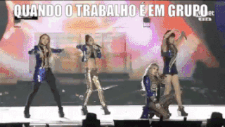
```
]

.pull-right[
Acesse [http://bit.ly/s2estatistica](http://bit.ly/s2estatistica)

* Email
* Nome
* RA
* Linha de Pesquisa
]

`r countdown(minutes = 2, seconds = 0, warn_when = 10, play_sound = TRUE, bottom = "10%")`

.footnote[Se você cair em um grupo que não goste, culpe o script R e a seed do gerador de números aleatórios. Coisas ruins acontecem, você pode escolher se isso vai ser uma oportunidade de crescimento ou não...]

---
# Créditos!

Slides criado pelo pacote R [`xaringan`](https://github.com/yihui/xaringan).

Código Fonte dos Slides disponível no GitHub [storopoli/Estatistica](https://github.com/storopoli/Estatistica).

.pull-left[
  ```{r hex_CIS}
  knitr::include_graphics("images/UNINOVE_CIS.png")
  ```
]

.pull-right[
  ```{r hex_PPGA}
  
  ```
]

[![CC BY-SA 4.0][cc-by-sa-image]][cc-by-sa]

[cc-by-sa]: http://creativecommons.org/licenses/by-sa/4.0/
[cc-by-sa-image]: https://licensebuttons.net/l/by-sa/4.0/88x31.png
[cc-by-sa-shield]: https://img.shields.io/badge/License-CC%20BY--SA%204.0-lightgrey.svg
