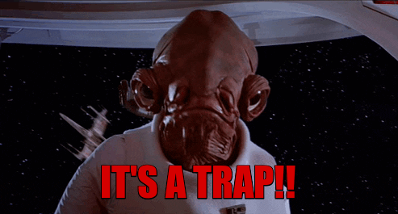

class: animated, fadeIn
layout: true

---
```{r setup, include=FALSE}
options(htmltools.dir.version = FALSE)
knitr::opts_chunk$set(fig.retina = 4,
                      warning = FALSE,
                      message = FALSE,
                      echo = FALSE)
```

```{r xaringan-themer, include=FALSE, warning=FALSE}
library(xaringanthemer)
# UNINOVE Colors
style_mono_accent(
  base_color = "#29427A",
  header_font_google = google_font("Josefin Sans"),
  text_font_google   = google_font("Montserrat", "300", "300i"),
  code_font_google   = google_font("Fira Mono"),
  text_font_size     = "1.5em",
  footnote_font_size = "0.5em"
)
```

```{r xaringan-logo, echo=FALSE}
# xaringanExtra tile view press key "O"
xaringanExtra::use_tile_view()

xaringanExtra::use_logo(
  image_url = "https://raw.githubusercontent.com/storopoli/UNINOVE-xaringan-theme/master/resources/uninove.png",
  link_url = "https://www.uninove.br",
  width = "110px",
  height = "55px")

xaringanExtra::use_fit_screen()
#xaringanExtra::use_animate_css()

# xaringanExtra webcam press key "W"
xaringanExtra::use_webcam()
```

# Por quê estou aqui?

.pull-left[
```{r out.width = '100%'}

```
]

--

.pull-right[
```{r out.width = '80%', fig.cap='Lancet, 2017'}
knitr::include_graphics("images/lancet-evidences.png")
```
]


.footnote[Djulbegovic, B., & Guyatt, G. H. (2017). Progress in evidence-based medicine: a quarter century on. The Lancet, 390(10092), 415-423.]

---

# Calma! Somos profissionais...

--
.pull-left[
* Tentativas de Homicídio: 0

*  Atentados à Imagem e Honra: 0

* Mandatos de Segurança: 0
]
--
.pull-right[
```{r out.width = '100%'}
knitr::include_graphics("images/borat-success.gif")
```
]

---
# Machine Learning vs Estatística
---
# Distribuições Normais e não-Normais
---
# Medidas de Centralidade
- Media
- Mediana
- Moda
---
# Medidas de Dispersão
- Desvio padrao
- Quantis

